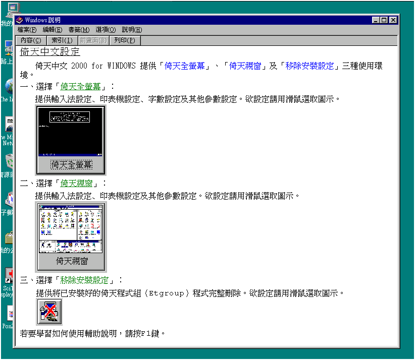
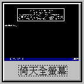
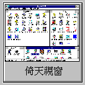

# 倚天中文設定

倚天中文 2000 for 提供「倚天全螢幕」、「倚天視窗」及「移除安裝設定」三種使用環境。

一、選擇「[倚天全螢幕](fullscreen.md)」：

提供輸入法設定､印表機設定､字數設定及其他參數設定。欲設定請用滑鼠選取圖示。

二、選擇「[倚天視窗](window.md)」：

提供輸入法設定､印表機設定及其他參數設定。欲設定請用滑鼠選取圖示。

三、選擇「[移除安裝設定](uninstall.md)」：

提供將已安裝好的倚天程式組（Etgroup）程式完整刪除。欲設定請用滑鼠選取圖示。

若要學習如何使用輔助說明，請按 F1 鍵。
