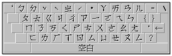

# 附錄 C、輸入法介紹

## C-1、注音輸入法

「自然輸入法」V5.04 提供國人最熟悉的「注音輸入法」，而鍵盤的對應上又可分為「標準」（即「大千」）、「[許氏](chapt-ad.md)」、「倚天」、「IBM」、「國喬」、「精業」、及「神通」等各家鍵盤。如果您有深厚的英打基礎，建議您採用「許氏鍵盤」，作為您注音輸入的鍵盤對應，只要十分鐘，即使在沒有注音符號的鍵盤上，也不減低您輸入的速度。（「許氏鍵盤」相關說明請參閱[附錄 D](chapt-ad.md)）

**（標準鍵盤）**

## C-2、拼音輸入法

「自然輸入法」V5.04 的中文拼音建構原則，是以大陸的漢語拼音為準。在中文拼音中，韻母（ㄚ、ㄛ、ㄜ、ㄧ、ㄨ……等）的拼音方式可分為兩種。一種為單獨出現，例如「ㄨ」這個音單獨出現時，應拼為 `wu`；另一種為和其它聲母（ㄅ、ㄆ、ㄉ、ㄊ、ㄋ……等）合併出現，則應拼為 `u`，例如「ㄆㄨ」應拼為 `pu`。

如果您翻開大陸的簡體字典，會發現「ㄨ」的對應英文為 `u`，而「ㄩ」的對應英文為 `u` 上面加了「‥」。在「自然輸入法」內，我們將「ㄨ」對到 `u`，而「ㄩ」則對到 `v` 或者 `yu`。有些使用者認為「ㄩ」也應該對到 `u` 才是。我們認為書上並沒有說「ㄩ」和「ㄨ」該對應在同一個英文，這完全看個人如何處理而定。我們選擇「ㄨ」和「ㄩ」有不同的對應，當然是為了避免造成更多同碼字帶來的混淆。

拼音輸入中聲調鍵的輸入，分別是由數字鍵 `1`、`2`、`3`、`4`、`5` 對應到一聲、二聲、三聲、四聲與輕聲。但是為了方便您在輸入的過程中，可以更流暢地輸入中文，所以本系統特別依注音「許氏鍵盤」聲調的排列方式，也放入拼音輸入法中（請參考下一章「許氏鍵盤」之介紹），讓您再也不必移開手指去按數字鍵。

**以下就是各個注音與中文拼音對應表：**

| 注音 | 英文拼音（單獨出現） | 英文拼音（與其它聲母合併） | 注音 | 英文拼音（單獨出現） | 英文拼音（與其它聲母合併） |
| ---- | -------------------- | -------------------------- | ---- | -------------------- | -------------------------- |
| ㄅ   | b                    |                            | ㄡ   | ou                   |                            |
| ㄆ   | p                    |                            | ㄢ   | an                   |                            |
| ㄇ   | m                    |                            | ㄣ   | en                   |                            |
| ㄈ   | f                    |                            | ㄤ   | ang                  |                            |
| ㄉ   | d                    |                            | ㄥ   | eng                  |                            |
| ㄊ   | t                    |                            | ㄧ   | yi                   | i                          |
| ㄋ   | n                    |                            | ㄧㄚ | ya                   | ia                         |
| ㄌ   | l                    |                            | ㄧㄠ | yao                  | iao                        |
| ㄗ   | z                    |                            | ㄧㄝ | ye                   | ie                         |
| ㄘ   | c                    |                            | ㄧㄡ | you                  | iu                         |
| ㄙ   | s                    |                            | ㄧㄢ | yan                  | ian                        |
| ㄓ   | zh                   |                            | ㄧㄣ | yin                  | in                         |
| ㄔ   | ch                   |                            | ㄧㄤ | yang                 | iang                       |
| ㄕ   | sh                   |                            | ㄧㄥ | ying                 | ing                        |
| ㄖ   | r                    |                            | ㄨ   | wu                   | u                          |
| ㄐ   | j                    |                            | ㄨㄚ | wa                   | ua                         |
| ㄑ   | q                    |                            | ㄨㄛ | wo                   | uo                         |
| ㄒ   | x                    |                            | ㄨㄞ | wai                  | uai                        |
| ㄍ   | g                    |                            | ㄨㄟ | wei                  | ui                         |
| ㄎ   | k                    |                            | ㄨㄢ | wan                  | uan                        |
| ㄏ   | h                    |                            | ㄨㄣ | wen                  | un                         |
| ㄚ   | a                    |                            | ㄨㄤ | wang                 | uang                       |
| ㄛ   | o                    |                            | ㄨㄥ | weng                 | ong                        |
| ㄜ   | e                    |                            | ㄩ   | yu                   | v                          |
| ㄦ   | er                   |                            | ㄩㄝ | yue                  | ue                         |
| ㄞ   | ai                   |                            | ㄩㄢ | yuan                 | uan                        |
| ㄟ   | ei                   |                            | ㄩㄥ | yong                 | iong                       |
| ㄠ   | ao                   |                            | ㄩㄣ | yun                  | un                         |

## C-3、倉頡輸入法

### （一）基本字形

倉頡輸入之字體以楷書為標準，再根據現有的中文字加以解析，將其中不易再分離且使用頻率較高之基本形，歸納出二十四個中文字母，再將此二十四個字母分為四大類，仿拼音字母之順序排列及依使用頻率編成口訣，分別配置在英文鍵盤上（另加上 `X` 鍵用來處理難字、重複字）。

| 類別      | 中文字母       | 英文鍵          | 口訣           |
| --------- | -------------- | --------------- | -------------- |
| 1. 哲理類 | 日月金木水火土 | `A.B.C.D.E.F.G` | 日月金木水火土 |
| 2. 筆畫類 | 竹戈十大中一弓 | `H.I.J.K.L.M.N` | 斜點交叉縱橫鉤 |
| 3. 人體類 | 人心手口       | `O.P.Q.R`       | 人心手口       |
| 4. 字形類 | 尸廿山女田卜   | `S.T.U.V.W.Y`   | 側並仰紐方卜   |

### （二）輔助字形

由於二十四個字母無法完全表達繁複的中文字形，因此選取與某倉頡字母意義相類似的字形或其變形，歸屬於同一倉頡字母，取碼時即用此倉頡字母代表。而此意義相類似的字形或其變形經歸納與選取後，稱之為該倉頡字母的輔助字形。所有的輔助字形一共有六十個，除了「口（R）」外，每一個倉頡字母，都有輔助字形，來加強該字母的代表性。

每個輔助字形產生的原則有二，只要您把握這兩個原則，就可以輕易地記住輔助字形。

- 依原字母之形狀變化而來
- 與該字母的意義相同

#### 1. 哲理類

| 字母    | 說明                                     | 例字                                           |
| ------- | ---------------------------------------- | ---------------------------------------------- |
| 日（A） | 取日的變形                               | 時、即、巴、眉、昌                             |
| 月（B） | 取月的外型；取月的變形                   | 胖、同、巾、冗、罕；采、受、炙、然、貓         |
| 金（C） | 取金的部分形；取金的變形                 | 弟、ㄚ、曾、脊；兌、父、匹、朮                 |
| 木（D） | 取木的主形；取木的變形                   | 寸、才、于、子；也、皮、五、夬                 |
| 水（E） | 取水為偏旁；取水的左右形重合；取水的變形 | 江、河、溪、海；各、支、後、叉；泰、求、膝、康 |
| 火（F） | 取字母的代表形；取火的上半形；取小的變形 | 灰、災、魚、馬；尚、肖、半、柬；不、系、少、紀 |
| 土（G） | 取土作偏旁；取土的變形                   | 地、坦、動、聽；吉、寺、壬、賣                 |

#### 2. 筆劃類

| 字母    | 說明                                             | 例字                                                       |
| ------- | ------------------------------------------------ | ---------------------------------------------------------- |
| 竹（H） | 取斜的定義；取斜的變形                           | 白、么、禾、八、狗；爪、反、斤、派、質                     |
| 戈（I） | 取點的定義；取點的變形                           | 之、犬、鹵、的、歹；台、云、即、店、庫                     |
| 十（J） | 取交的定義；取交的變形                           | 毋、廾、段、斗、聳；穴、宋、客、安、寶                     |
| 大（K） | 取叉的定義；取叉的部分形；取叉的變形             | 希、乂、艾、交；有、左、九、尹、帶；犯、狗、狄、病、痛     |
| 中（L） | 取縱的定義，由上而下；取縱的變形；取縱的變化形   | 川、片、更、沈、非；聿、書、妻、肅；衫、初、被、裡         |
| 一（M） | 取橫的定義，由左而右；取工或厂的變形；取一的變形 | 上、孑；巫、巧、仄、原、兀；刁、孑、羽、准、路             |
| 弓（N） | 取鉤的定義；取鉤的變形；取鉤的變化形             | 丁、了、小、予、秀；乙、又、疋、久、丑；几、九、气、夕、角 |

#### 3. 人身類

| 字母    | 說明                                             | 例字                                                                   |
| ------- | ------------------------------------------------ | ---------------------------------------------------------------------- |
| 人（O） | 取人作偏旁；取人作字首；取人的部分形；取人的變形 | 仁、兵、很、足、雀；矢、年、每、內、合；孓、八、爪、入、之；兆、豕、承 |
| 心（P） | 取心作偏旁或字尾；取心的變形；取匕的變形         | 怡、情、恭、慕；旨、世、勺、象；屯、式、氏、切                         |
| 手（Q） | 取手作偏旁；取手的主形；取手的變形               | 扣、哲、找、牡；丰、毛、生、牛；夫、券、韋、年                         |
| 口（R） | 無                                               | 師、巳、民、趾                                                         |

#### 4. 字形類

| 字母    | 說明                             | 例字                               |
| ------- | -------------------------------- | ---------------------------------- |
| 尸（S） | 取側的定義，左右開口；取尸的變形 | 己、君、巨、匹；力、刁、長、取     |
| 廿（T） | 並的定義為兩形相並；取並的變形   | 花、草；卉、並、皿、叢、聯、虛、黃 |
| 山（U） | 仰的定義為向上開口；取山的變形   | 凶、函、齒、自；朔、芻、匕、乩     |
| 女（V） | 紐的定義為曲紐；取女的變形       | 災、巡、幻、玄；亡、收、氏、衣、長 |
| 田（W） | 方的定義為一方框；取口的變形     | 回、國、酉、黑；母、毋、貫、實     |
| 卜（Y） | 取卜的變形；取卜的變化形         | 市、卞、上、卓；冬、斗、迴、進     |

### （三）取碼方式

1. 取碼通則（以五碼為限）

   1. 取碼順序：依由外而內、由上而下、由左而右順序取碼。
   2. 字首取碼：限取一至二碼，超過者則取首、尾兩碼。
   3. 字身取碼：可取一至三碼，超過者則取首、次、尾三碼。
   4. 連體字取碼：限取四碼，依序取首、次、三、尾四碼。

2. 取碼原則

   1. 取碼以精簡為上：一字若有多種取碼可能，以碼最少為正取。
   2. 取形必須完整：取碼數若相等，先取字形繁複之碼。
   3. 注意字形特徵：不犧牲字形特徵，避免取形重疊及在轉角分割。
   4. 字形省略原則：部分省略及包含省略。
