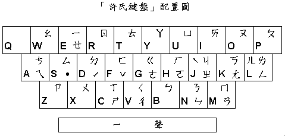

# 附錄 D、許氏鍵盤

除了傳統注音鍵盤的排列方式外，本產品還提供「[許氏鍵盤](hsu.md)」可簡化您記憶上的負擔，尤其您對英打熟悉的話，「[許氏鍵盤](hsu.md) 」更是您的好幫手。

## D-1 、「許氏鍵盤」排列

為了簡化您記鍵盤的負擔，「 [許氏鍵盤](hsu.md)」只用了二十五個鍵（不像標準注音鍵盤用了四十二個鍵）；緣此，「[許氏鍵盤](hsu.md)」的排列方式非常適合對英文鍵盤熟悉的人使用。

根據我們的實驗，對一個有英打基礎的人而言，瞭解「[許氏鍵盤](hsu.md)」的配置只需十分鐘，而在試用一個小時後，就可牢記對應方式而不必再依賴對應表。就算是不熟悉英文鍵盤的人，也只要極短的時間，就能學會「許氏鍵盤」的中英文輸入，以相同的時間同時學會中、英打，免除二次學習的困擾，可以讓您在輸入中英文混雜的資料時，更加輕鬆容易。



## D-2 、「許氏鍵盤」對應說明

「 [許氏鍵盤](hsu.md)」的對應可分為[字母](#class-1)、[字鍵順位與整組記憶](#class-2)、[手順](#class-3)等三大類，茲分述如下。

「許氏鍵盤」對應表

<table style="width:100%;" data-border="" data-cellspacing="1"
data-cellpadding="2" width="540">
<colgroup>
<col style="width: 14%" />
<col style="width: 14%" />
<col style="width: 14%" />
<col style="width: 14%" />
<col style="width: 14%" />
<col style="width: 14%" />
<col style="width: 14%" />
</colgroup>
<tbody>
<tr>
<td width="6%" data-valign="TOP"><p>字音</p></td>
<td colspan="6" width="94%"
data-valign="TOP"><p>ㄅㄆㄇㄈㄉㄊㄋㄌㄍㄎㄏㄐㄒㄖㄗㄙㄝㄞㄟㄡㄣㄧ</p>
<p>ＢＰＭＦＤＴＮＬＧＫＨＪＣＲＺＳＥＩＡＯＮＥ</p></td>
</tr>
<tr>
<td width="6%" data-valign="TOP"><p>字形</p></td>
<td width="36%" data-valign="TOP"><p>ㄑㄚㄠㄢㄤㄥㄦㄨㄩ</p>
<p>ＶＹＷＭＫＬＬＸＵ</p></td>
<td width="5%" data-valign="TOP"><p>對應</p></td>
<td width="18%" data-valign="TOP"><p>ㄓㄔㄕㄘ</p>
<p>ＪＶＣＡ</p></td>
<td width="5%" data-valign="TOP"><p>手順</p></td>
<td width="25%" data-valign="TOP"><p>˙ˊˇㄜㄛˋ</p>
<p>ＳＤＦＧＨＪ</p></td>
<td width="6%" data-valign="TOP"><p>標點</p></td>
</tr>
</tbody>
</table>

## 第一類：字母

### (1)字音相似者

◆ 利用英文字母所對應的音標發音

```
ㄅㄆㄇㄈㄉㄊㄋㄌㄍㄎㄏㄐㄖㄗㄙㄝ
ＢＰＭＦＤＴＮＬＧＫＨＪＲＺＳＥ
```

◆ 利用英文字母本身的發音

```
ㄒㄞㄟㄡㄣㄧ
ＣＩＡＯＮＥ
```

### (2)字形相似者

- ㄠ ← W 逆時針轉 90 度
- ㄑ ← V 逆時針轉 90 度
- ㄢ ← M 將ㄢ之上下兩部分之中間合併則成ㄋ，再逆時針轉 90 度
- ㄤ ← K 逆時針轉 45 度
- ㄥ ← L 字形相似
- ㄦ ← L ㄦ的右半邊與 L 相似
- ㄚ ← Y 字形相似
- ㄨ ← X 字形相似
- ㄩ ← U 字形相似

## 第二類：字鍵順位，整組記憶

1\. 基本上，ㄗ和ㄙ也都是利用字母發音來記憶，而ㄘ在整個鍵盤上，放置在 A 的位置最理想，因為這樣在注音拼法上絕不會造成混淆，並可將ㄗㄘㄙ放在一塊兒。

```
ㄗㄘㄙ
ＺＡＳ
```

2\. 在這組鍵位裡，他們也都可以使用字母的音、形對應

```
ㄐㄑㄒ
ＪＶＣ
```

- ㄐ → J 音標相似
- ㄑ →V 字形聯想
- ㄒ →C 發音相近

※另外，再利用ㄐㄑㄒ與ㄓㄔㄕ的對稱性，加強聯想。

## 第三類：手順

這個部份的設計是為了手指方便所做的考慮

o ㄜ → G ， ㄛ → H

\(2\) 聲調鍵

- -一聲 → 空間棒 四聲 → J
- 二聲 → D 輕聲 → S
- 三聲 → F

一般而言，使用注音輸入法輸入中文，平均每個字需要 3.13 鍵，而這 3.13 鍵裡，「聲調鍵」就佔了 1/3 的時間。而為了能讓左右手的操作頻率相當，「許氏鍵盤」特別統計了中文字五個聲調的使用頻率，其中，輕聲約佔百分之三；第一、二、三聲都在百分之二十左右；而第四聲則在百分之四十左右。

因此，我們將輕聲、二聲及三聲放在左手中排，分別是\<S,D,F\>鍵，第四聲則放在右手中排，即\<J\>鍵，讓左右手各有百分之四十的操作頻率，第一聲則不予變動依然置放在空間棒的位置。如此，不僅左右手能均衡操作電腦，且無需再使用到數字鍵，大大的簡化了您手指的負擔（請注意：拼音輸入的聲調鍵也適用此法）。

以上的排法，將三十七個注音符號及五個聲調符號對應至「二十五個」英文字母上，且保留了\<Q\>鍵，讓您可直接切換輸入行游標所在字的前三個同音字，簡化您選同音字的時間。而由於中文輸入只佔用 25 個字母鍵，因此鍵盤上的標點符號鍵可完全供輸入中文標點符號使用。

當系統選字錯誤需要以同碼/同音功能修正時，我們另以鍵盤歸位行上的 A,S,D,F...L 分別代替 1,2,...,9 等選字鍵，並在螢幕選字號碼下分別顯示這些相對的英文字鍵，因此，即使您仍以人工選字，也可提昇效率。希望製作中文系統的廠商能納入考慮，我們絕對樂意免費授權任何廠商使用。

在看完上述的介紹後，也許您會認為：對一個從未接觸過英文的人（如國小學生），這種聯想的方式似乎並無多大意義，何不多注意一下對手指方便的排列方式即可。針對此點，我們認為：對一個初學打字的人，不論那一種鍵位的排列方式其實都沒有多大的差別。相反的，在熟習了「[許氏鍵盤](hsu-key/gokey.html)」之後，由於逆向聯想的幫助，以後再學習英打時，就可以駕輕就熟了，這樣豈不是省卻了二次學習的困擾嗎？

「許氏鍵盤」的設計是邁向注音「盲打」快速輸入的第一步。但若您尚未適應「許氏鍵盤」，您可以利用「Alt + =」來切換「許氏鍵盤」和「傳統鍵盤」。
