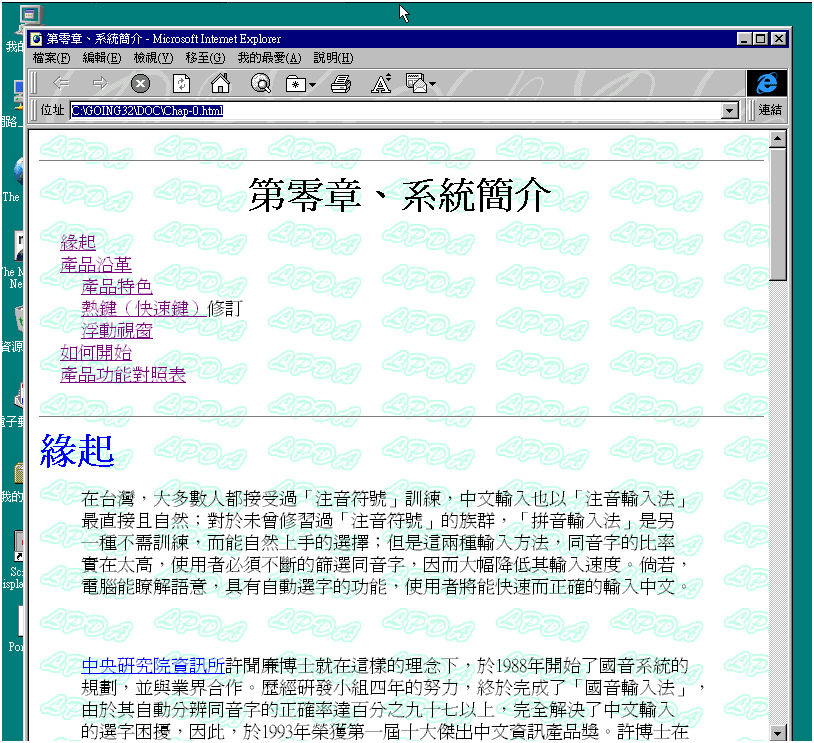

# 第零章、系統簡介

## 緣起

在台灣，大多數人都接受過「注音符號」訓練，中文輸入也以「注音輸入法」最直接且自然；對於未曾修習過「注音符號」的族群，「拼音輸入法」是另一種不需訓練，而能自然上手的選擇；但是這兩種輸入方法，同音字的比率實在太高，使用者必須不斷的篩選同音字，因而大幅降低其輸入速度。倘若，電腦能瞭解語意，具有自動選字的功能，使用者將能快速而正確的輸入中文。

中央研究院資訊所許聞廉博士就在這樣的理念下，於 1988 年開始了國音系統的規劃，並與業界合作。歷經研發小組四年的努力，終於完成了「國音輸入法」，由於其自動分辨同音字的正確率達百分之九十七以上，完全解決了中文輸入的選字困擾，因此，於 1993 年榮獲第一屆十大傑出中文資訊產品獎。許博士在注音輸入上另外一個重要的發明就是「許氏鍵盤」，這是一個將注音自然對應到 26 個英文字母上的中打注音鍵盤，讓您在短短二十分鐘內就能上手打中文。將中打、英打合而為一，不必重新學習中打，讓您一輩子受用不盡。

繼「國音輸入法」推出後，許博士於 1994 年再推出智慧程度更高的「自然注音輸入法」。究其意，不外乎是認為這樣的一個軟體，可以讓使用者自自然然、毫無窒礙的輸入中文。其最終目的，則在提供中國人一個簡單、易學、快速的中文輸入環境。

## 產品沿革

本產品源自 DOS 時代「國音輸入法」、「自然輸入法」，Windows3.1 環境的「自然輸入法」，Windows3.1/Windows95 環境的 OPEN CHINESE；至今，再次以「自然輸入法」V5.04（for Windows 95/WindowsNT/Windows2000）的新面貌，呈現在您面前。配合時代的進步，5.04 版強化語意分析能力，並融合多種輸入法、語音功能、容錯能力，並調整人機介面；茲將 5.04 版本的特色及與過去版本不同的地方，說明如下：

### 產品特色

1. 整合多種輸入法：「自然輸入法」V5.04 包含注音、拼音、倉頡等三種不同輸入法，適合不同族群使用。
2. 全句語意分析：「自然輸入法」V5.04 融合人工智慧、自然語言分析功能，檢索前後文，自動幫您挑選適當的詞，改變傳統字字校對的缺點；不需要苦練，只要您常用，就可以提升您打字速度。
3. 慣用語自動學習：依據您個人的使用習慣、用語、常用詞彙，自動建立「個人專屬詞庫」，越用越順手、越用越貼心。此外，您還可以利用「學習精靈」『讀』您過去寫作的文章，自動鍵詞，加速「個人專屬詞庫」的建立。
4. 方便的容錯能力：對於注音、拼音輸入法的使用者，可以利用近音字功能「↑」，『找』到您要的字，不必再為了捲不捲舌而大傷腦筋；對於倉頡輸入法的使用者，同碼字可藉助語意的輔助，節省您挑字的時間。例如：「水竹尸大」找到—激、淚，使用「自然輸入法」他會配合前後文幫您確認您是「感激」，還是「流淚」。
5. 獨特語音輸出：搭配語音插卡，適時的「自然輸入法 V5.04」會提醒您，您現在的動作；「同步發音」告訴您現在輸入些什麼，「整篇發音」把文章讀一遍給您聽，處處展現本產品貼心的一面。
6. 常用符號表：您不再受限於一般編輯文書工具不提供符號表之不便，而使用鍵盤上之標點符號，輕輕一按，即可挑選您需要的符號。

### 熱鍵（快速鍵）修訂

在「視窗」環境中，許多應用軟體的熱鍵（快速鍵）都使用「ALT」為輔助鍵，因此在新的一版裡，輔助鍵更換為「CTRL」，或許初期使用上，您有所不便，為了能與大多數軟體相容，我們不得不修改之。

此外，環境設定的熱鍵（快速鍵）更換為[Ctrl+F1]，如果您習慣用[ALT+Z]來設定環境，請您配合此次輔助鍵的修訂，適應一下；其他的熱鍵，請參閱附錄 A。

### 浮動視窗

「輸入行」與「工具列」採「浮動視窗」設計，您可依需要調整「工具列」上控制項數目，也可將「工具列」固定在特定位置，不妨礙您的輸入。您也可以經由設定的方式，將「輸入行」、「工具列」分開放置，或採「游標跟隨」的方式，不顯示「輸入行」。

## 如何開始

如果您是第一次使用本產品，您可參照第一章說明，試用一遍。如果您曾經使用過本產品，您可依相關章節，選取您需要的內容。不過在您安裝本產品之前，請先依第二章檢查您的個人電腦配備。

## 產品功能對照表

| 功 能                   | 「許氏鍵盤」推廣版 V5.00 | 自然新注音 V5.00  自然新拼音 V5.00 | 自然輸入法 V5.04 |
| ----------------------- | ------------------------ | ------------------------------------- | ---------------- |
| 輸入法 注音（許氏鍵盤） | ○                        | ○                                     | ○                |
| 輸入法 注音（標準鍵盤） | -                        | ○                                     | ○                |
| 輸入法 倉頡             | -                        | -                                     | ○                |
| 輸入法 拼音             | -                        | -                                     | ○                |
| 輸入法 詞庫             | -                        | -                                     | ○                |
| 控制列 設定工具列       | -                        | -                                     | ○                |
| 控制列 中/英文          | ○                        | ○                                     | ○                |
| 控制列 全/半形          | ○                        | ○                                     | ○                |
| 控制列 符號表           | ○                        | ○                                     | ○                |
| 控制列 滑鼠鍵盤         | ○                        | ○                                     | ○                |
| 控制列 輔助辭典         | ○                        | （ 20 個詞彙） ○                      | ○                |
| 控制列 自動學習         | ○                        | ○                                     | ○（可關閉）      |
| 控制列 浮動視窗         | ○                        | ○                                     | ○（可關閉）      |
| 發音 同步發音           | -                        | ○                                     | ○                |
| 發音 整篇發音           | -                        | -                                     | ○                |
| 發音 調整語音           | -                        | -                                     | ○                |
| 工具 注音學習精靈       | -                        | -                                     | ○                |
| 工具 隨身包             | -                        | -                                     | ○                |
