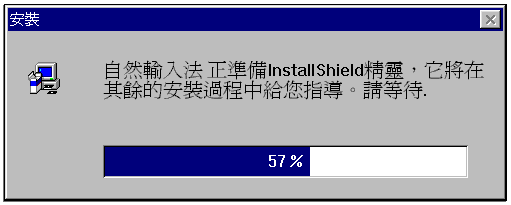
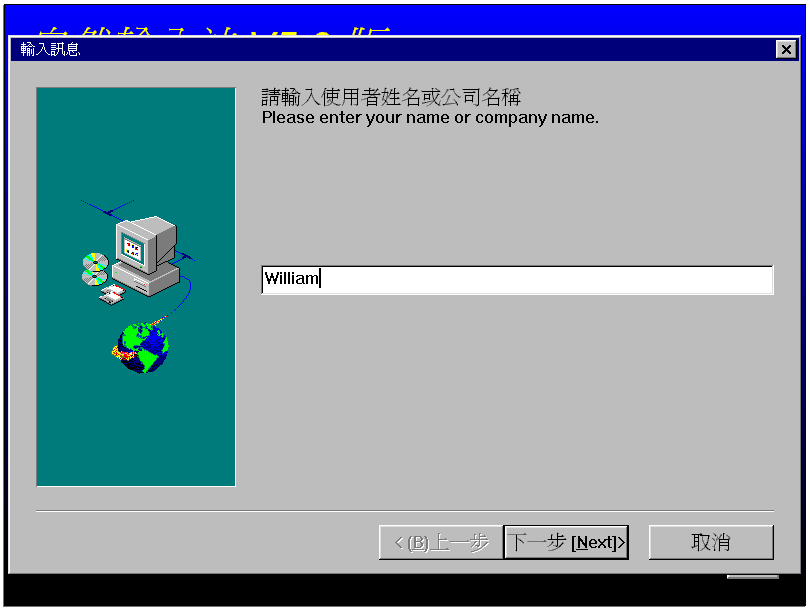
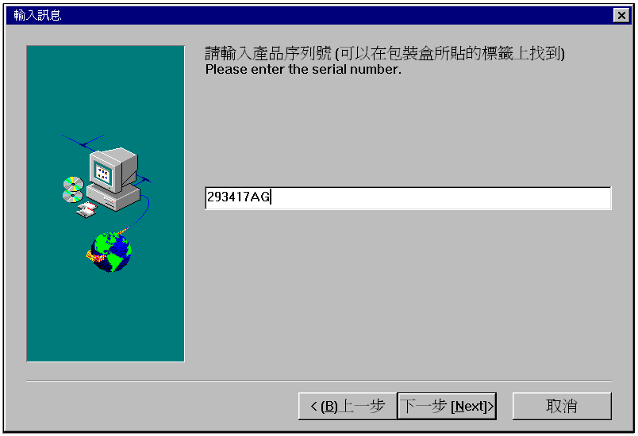
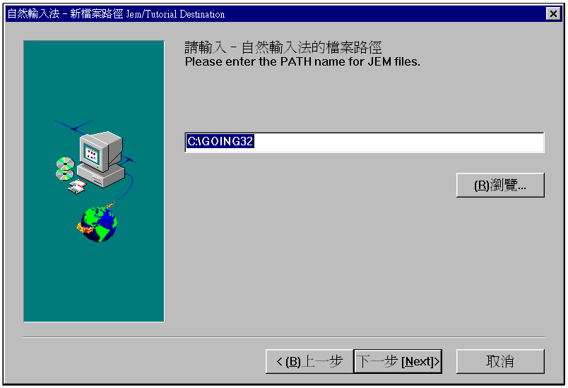
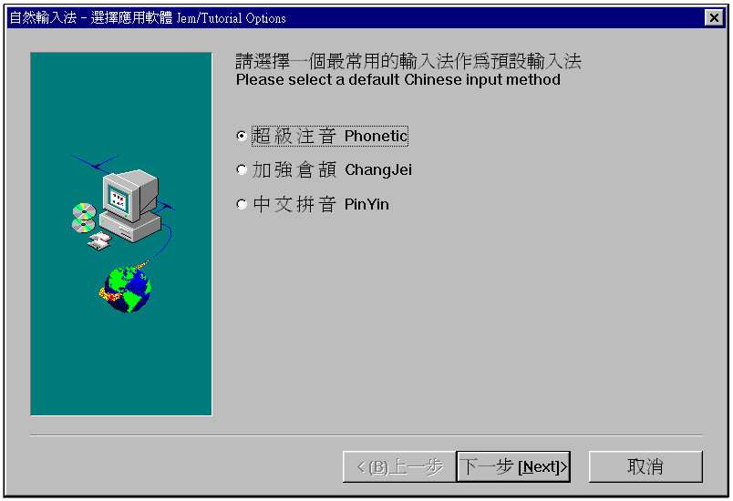
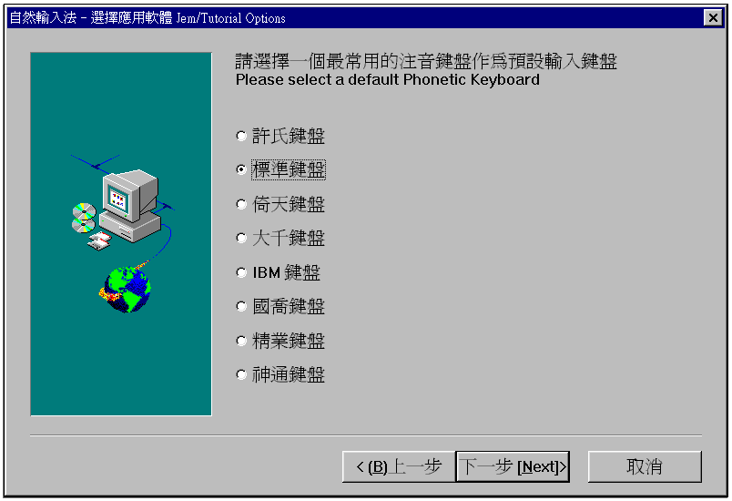
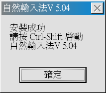

# 第二章、系統安裝

## 2-1、環境需求

### 1. 硬體需求

- IBM 相容 PC（486 或 pentium）主機
- 主記憶體至少 16MB 以上（建議配備 32MB）
- 硬碟空間需要 18MB
- 光碟機（安裝使用）
- 聲霸卡（16 位元 Sound bluster 相容卡）及喇叭

### 2. 軟體作業環境

- Microsoft Windows 95 中文版或
- Microsoft Windows 98 中文版或
- Microsoft Windows NT 中文版

### 3. 相容套裝軟體表列

- MS Office 95
- MS Office 97
- IE 3.x
- IE 4.0
- Netscape 4.01 中文版

注意：

16 位元的應用軟體，當搭配「自然輸入法」時，可能會產生當機現象。

這是因為「自然輸入法」是 32 位元軟體，在 Windows 環境下，與 16 位元軟體搭配， Windows 會產生錯誤，甚至引起當機。至於如何判斷您使用的軟體是不是 16 位元軟體？ 如果您的軟體可在 windows 3.1 及 windows 95 使用，表示該軟體是 16 位元軟體。

## 2-2、 安裝

安裝本產品前，請先確認沒有正在使用「自然輸入法」（或請關掉所有應用軟體再安裝），然後翻閱 CD 包裝盒，準備好您的「序號」。

| 步驟 | 安裝說明                                                                   | 參考圖示                                                                                              |
| ---- | -------------------------------------------------------------------------- | ----------------------------------------------------------------------------------------------------- |
| 1    | 將「自然輸入法」V5.04 光碟片放入光碟機中。                                 | 　                                                                                                    |
| 2    | 自「檔案總管」或「我的電腦」中，開啟光碟機，選擇安裝程式（Setup）執行。    |  光碟機   安裝程式 |
| 3    | 安裝程式會準備所有安裝必要之工作，同時顯示圖示告知您，安裝正在進行中。     |                                                         |
| 4    | 請輸入您的姓名或公司名稱。                                                 |                                                       |
| 5    | 請輸入您的序號，以便確認您是合法的使用者（請檢查光碟片包裝盒上序號）。     |                                                               |
| 6    | 輸入「自然輸入法」V5.04 安裝的位置（內定值為 C:\GOING32）。                |                                                                   |
| 7    | 選擇個人常用之輸入法模式（例如：超級注音）。                               |                                                                   |
| 8    | 如果您使用「注音輸入法」，您還需要告訴系統，採用哪種鍵盤。（例如標準鍵盤） |                                                                     |
| 9    | 程式安裝完成後，系統會顯示安裝完成畫面，您可開始使用「自然輸入法」V5.04。  |                                                               |

## 2-3、解安裝

在解除安裝之前，請先確認沒有正在使用「自然輸入法」（或請關掉所有應用軟體再安裝）。 解除「自然輸入法」V5.04 的方法很簡單，只要選取「開始」→ 「程式集」→ 「自然輸入法」→ 「解安裝自然輸入法」，在確認您的動作後，就會將「自然輸入法」V5.04 解安裝，但原目錄會保留，避免您個人的詞庫被清掉。
