# 第三章、操作介面

本章介紹「自然輸入法」V5.04 相關的人機操作介面，以及一些功能介面的設定（控制列、輸入法、輸入行、語境、語音）。

## 3-1、人機介面

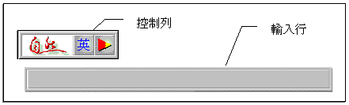

當您第一次啟動「自然輸入法」V5.04（如果您曾經安裝過「自然輸入法」， 顯示的項目會以您前次安裝時的選項顯示）後，您所見到的畫面， 分為：「控制列」(「中」、「英」文狀態視當時[CAPS LOCK]鍵狀況而定)及「輸入行」兩類。

「輸入行」暫存您目前正在輸入的文字，同時智慧的分析語法、語意，幫您挑選適切的詞彙（參閱圖）。您可拉長（或縮小）「輸入行」，但系統預設「輸入行」最小長度為九個中文字（顯示時，五個中文字加上四個注音符號位置），最長視螢幕解析度而定（800x600 是 28 個中文字，1024x768 是 33 個中文字）。

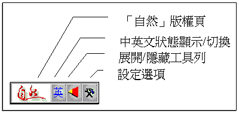

初始控制列圖示說明「控制列」具有顯示狀態、改變輸入法、顯示功能的用途；當您按下「顯示所有工具列」，您 所看到的畫面（內定最少項目是「設定選項」），如果全部展開，所有的操作項目如圖所示（相關說明與設定，請參閱下一節）。

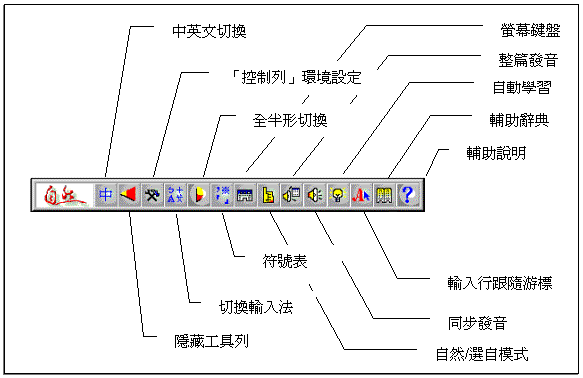

## 3-2、環境設定

人機介面的「控制列」項目，可由使用者依據使用上的實際需要，調整相關項目的顯現與否。譬如，「同步發音」的功能，在開放的辦公室環境，易造成對他人的干擾，可是在實務上，又可提醒您輸入了哪些文字，此時您可開放「同步發音」到「控制列」（如圖所示），平時使用時，關閉其功能，在文字輸入時，才打開「同步發音」，協助您登打、校對。

您可點選中「設定選項」，進入 「控制列」環境設定。相關的設定與使用如後所述：

### 設定「控制列」項目

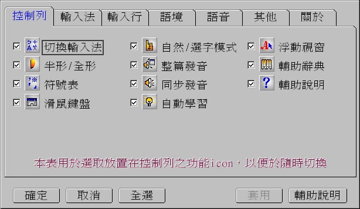

所有「控制列」的項目，可經由點選 □（CHECK BOX）後，出現在「控制列」上；例如：除了「同步發音」會出現在「控制列」外，其他項目都不顯示，設定方式與結果」。
茲將各個項目的功能說明如下：

| 功能                                                                            | 說明                                                                                                   |
| ------------------------------------------------------------------------------- | ------------------------------------------------------------------------------------------------------ |
| 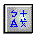 切換輸入法                                   | 您可透過此項目，直接呼叫出「輸入法」的設定畫面。                                                       |
|  全形   半形 | 此項目可讓您選擇「全形」或「半形」字體，同時也顯示目前操作狀態。                                       |
|  輔助辭典                                    | 顯示目前「自然輸入法」記住（或學習得到）的詞彙。                                                       |
|  符號表                                           | 呼叫「符號表」，選取符號。                                                                             |
| 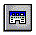 滑鼠鍵盤                                        | 啟動「滑鼠鍵盤」，您可以滑鼠點選，入注音符號。                                                         |
|  自然模式                                   | 「自然輸入法」根據您輸入的「字碼」、前後文，自動分析您的語意，調整相關文字。                           |
|  選字模式                                  | 當您輸入「字碼」，「自然輸入法」顯示同首碼字，直到您輸入完所有的「字碼」，再選擇文字（即不分析語意）。 |
|  整篇發音                               | 「讀」您複製到「剪貼簿」的文章。                                                                       |
|  同步發音                                 | 當您輸入文字時，電腦同步「唸」出該字的音，省卻您抬頭檢視文字的麻煩。                                   |
|  自動學習                                  | 在您輸入文字時，「自然輸入法」自動學習您的詞彙使用習慣，並將學習到的詞彙，存入「輔助辭典」。           |
|  浮動視窗                                 | 系統初設的使用方式會顯示「輸入行」，您可將之隱藏，在輸入時，再顯示輸入的文字。                         |
|  輔助說明                                      | 顯示本線上說明文件。                                                                                   |

### 選擇「輸入法」

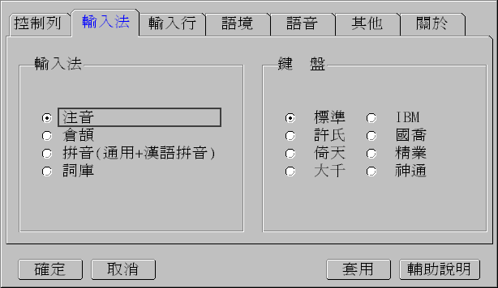

當您更換輸入法時，可點選您需要的輸入方式；如果使用的是「注音輸入法」，您還可選擇，習慣使用的鍵盤對應方式。（輸入法相關說明，請參閱 5-3 節、附錄 C、附錄 D）

### 選擇「輸入行」環境

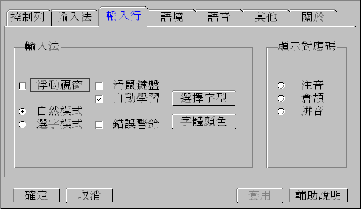

「設定輸入行」是設定「輸入行」相關項目，部分項目的功能，與「控制列」項目相同（請參閱設定「控制列」），方便您使用。茲說明其他項目：

| 選項     | 說明                                                                                                                |
| -------- | ------------------------------------------------------------------------------------------------------------------- |
| 錯誤警鈴 | 在您輸入錯誤的「字碼」（或注音符號）時，系統發出聲響，提醒您按錯鍵。                                                |
| 選擇字型 | 設定「輸入行」的字體及大小。                                                                                        |
| 字體顏色 | 設定「輸入行」字體的顏色。                                                                                          |
| 對應碼   | 顯示指定的對應碼。例如：以「注音」輸入文字的同時，顯示「倉頡」的「字碼」，藉此，您可獲得 另一種輸入法的「輸入碼」。 |

### 選取「語境」

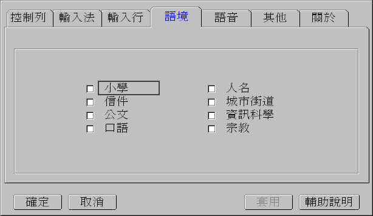

在一般的使用上，您可能沒感覺到「語境」對您生活上的影響；試試看「 ㄔㄥ ˊ ㄕ ˋ」，您預期是哪個「城市」、「程式」、「成事」、「成是」？當然「自然輸入法」可以依據整段文字，幫您挑選，但您也可以預設「語境」，在未經學習之前，優先考慮哪一個「ㄔㄥ ˊ ㄕ ˋ」。例如：您選擇「資訊科學」的語境，「自然輸入法」在第一次遇到「ㄔㄥ ˊ ㄕ ˋ」會優先考慮「程式」，但經過學習後，就會以上次使用過的「ㄔㄥ ˊ ㄕ ˋ」優先。（目前系統預設的「語境」上限數量是四個）

### 「語音」功能

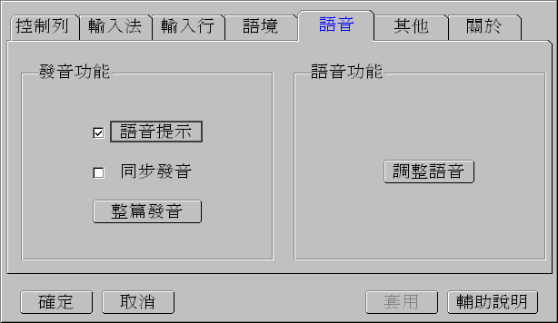

「自然輸入法」具備語音功能，您可依需要選擇適當的作業方式。

| 功能     | 說明                                                                                             |
| -------- | ------------------------------------------------------------------------------------------------ |
| 語音提示 | 在您每次使用時，適時的提醒您目前操作狀態，不至於在英文模式「狂打」，才突然發現，輸入的是英文字。 |
| 同步發音 | 與「控制列」的同步發音是一樣的，輔助您輸入時，停醒您入的文字。                                   |
| 整篇發音 | 直接執行「整篇發音」，將「剪貼簿」的文字「唸」一遍。                                             |
| 調整語音 | 您可依個人喜好，調整發音，一般而言，成人男性頻率較低，女性居中，小孩較高。                       |

### 「其他」項

最後，「其他」設定畫面，您可選用「材質」，改變您輸入行的視覺；改變「固定控制列」位置（內定「控制列」與「輸入行」是並行存在），使用「輸入行」設定的「自訂字型」；以及最重要的「更換詞庫檔」（參閱 5-3 節說明）。您建立「詞庫檔」，並經轉換處理後，必須透過此一動作，載入新的「詞庫檔」，您才能夠使用您的「詞庫」。 「版權頁」則是呼籲您，請重視您使用軟體的合法性。

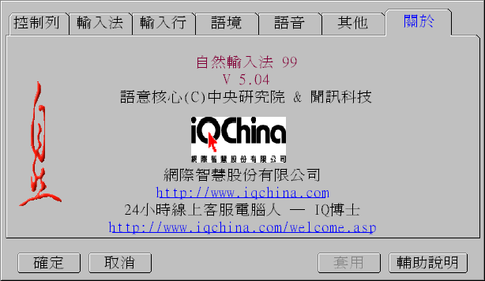
