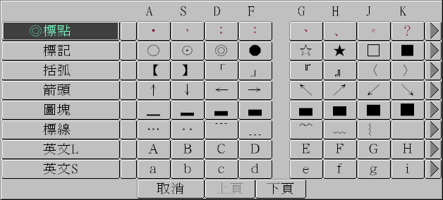
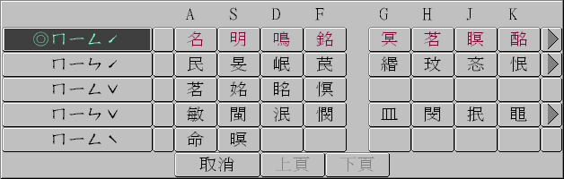
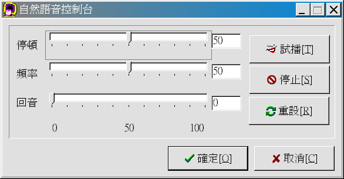
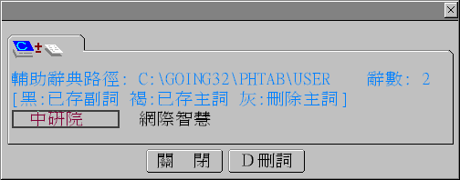

# 第四章、基本操作

經過上一章人機介面的介紹，您一定想瞭解如何使用「自然輸入法」，以及一些相關資訊。

## 勤前教育

基本上，「自然輸入法」是個輸入法，就像 Windows 環境裡其他輸入法一樣，**它是與「應用軟體」搭配，成對出現**。譬如：您正在使用「記事本」，打開了「自然輸入法」，使用「注音」輸入，此時，「自然輸入法」與「記事本」產生關聯性，系統記得「記事本」→「自然輸入法」的「注音輸入」；當您另外打開「Word」，也啟動「自然輸入法」，使用「倉頡」輸入，此時，系統會記得「WORD」→「自然輸入法」的「倉頡」輸入。當您回到「記事本」，會看到「注音」輸入的「自然輸入法」；再到「WORD」，又可使用「倉頡」輸入。系統會保存共用的資訊，減少系統資源的使用，直到您關閉「記事本」與「WORD」，系統才會釋放與「自然輸入法」相關的資源與資訊。

就因為如此，當您在安裝或解安裝時，千萬記得先關閉所有的「應用軟體」（最好是所有不需要的軟體），避免在檔案複製時，因為系統未釋放資源，產生安裝或解安裝過程不完全。此外，更新相關資料檔後（例如：詞庫檔），必須重新啟動「應用軟體」，再打開「自然輸入法」才會發生效用。

## 4-1、啟動

「自然輸入法」V5.04 與系統的輸入法結合，啟動方法可分為兩種：

1. 「滑鼠」啟動：使用滑鼠，點選右下方的  切換至 ，出現下方版權頁就完成啟動動作。

2. 「鍵盤」啟動：按下 `[Ctrl]`（控制鍵）與 `[Space]`（空白鍵）兩鍵，切換為中文輸入法，再按 `[Ctrl]`（控制鍵）與 `[Shift]`（移位鍵）兩鍵，直到出現本產品版權頁。

啟動後會出現「輸入行」 及「控制列」 兩個視窗。（詳見[第三章 3-1 節「人機介面」](chapt3.md)）

## 4-2、符號輸入

當我們在輸入中文時，常會使用一些「標點符號」。在使用「自然輸入法」時，您有下列三種方式輸入需要的符號。

1. 鍵盤輸入：在「中文模式」下，「自然輸入法」應用 `SHIFT` 鍵及符號區，納入一些常用的符號。

| 鍵盤按鍵 | 對應符號 |
| --- | --- |
| `[` | `「` |
| `]` | `」` |
| `[SHIFT]+[` | `『` |
| `[SHIFT]+]` | `』` |
| `[SHIFT]+'` | `、` |
| `[SHIFT]+,` | `，`（「許氏鍵盤」的使用者可直接按 `,` 輸入 `，`） |
| `[SHIFT]+;` | `：` |
| `[SHIFT]+’` | `；` |
| `[SHIFT]+.` | `。` |

2. 滑鼠點選：點選「控制列」中的「符號表」項目，找出您需要的符號。

3. 呼叫「常用符號」：以熱鍵 `[Ctrl-7]` 叫出最近使用過的符號表；如果找不到您要的符號，再選 `[全]`，調出完整「符號表」。

## 4-3、同音、近音

### 同音

不論您是使用哪種輸入法，都免不了需要做選字的動作；「自然輸入法」的語意分析功能，幫您解決大部分的同音、同碼字挑選上的問題，但仍有少部分非常用詞彙需要選字。此時您將游標移至要修改的字上，按 `[↓]` 鍵啟動同音字表，移動 `[↓]` 或 `[↑]` 鍵，以代碼選取您要的字。

例如：第一章的使用範例中，移動到「名」字上，按下 `[↓]` 鍵，就會出現同音字表，如上圖所示，您可按 `[2]` 鍵選擇「明」字。

### 近音

此外，由於鄉音及語言發音關係，捲舌與否常造成國人在學習及使用上的困擾。「自然輸入法」的近音功能，讓您只要移動游標至要修改的字上，按下 `[↑]` 鍵，「自然輸入法」就會顯示所有近音字表，讓您選擇所需要的字。

例如：「名」字的近音字表如上圖所示，您可移動游標至 `ㄇ一ㄣ ˊ`，然後選 `[1]` 的「民」字。

## 4-4、發音

「自然輸入法」具備發音能力，配上聲霸卡，結合本身的語意分析功能，使得電腦的聲音不再那麼硬梆梆。

- **同步發音**：輸入文字時，同步「唸出」字的讀音；您可透過「控制列」上的「同步發音」圖示，控制該功能是否使用。
- **整篇發音**：此功能係將文章唸一遍；不過使用上，您必須先將要唸的文章複製到「剪貼簿」，再使用此功能「唸」文章。一次能「唸」的文章，受限於「剪貼簿」容量大小，最多不能超過三萬兩千個中文字（含所有符號、空白）。
- **調整發音**：每個人對聲音的喜好有所不同，因此「自然輸入法」包含了一個小工具「調整發音」。您可調整兩個音之間的停頓時間、呈現的頻率（男聲在 30 以下，童音在 70 以上，中間是女聲）；「回音」則使得聲音聽起來更圓潤。

## 4-5、輔助辭典（一）

雖然「自然輸入法」發展時收錄了數十萬筆日常生活常用語，但時代變遷後，每個人用詞遣字也都有自己的偏好。以有限的詞彙、用語，無法滿足社會大眾的需要，因此「自然輸入法」具備「自動學習」的能力，透過您平日的使用，點點滴滴記錄下您個人的用詞習慣，使得「自然輸入法」成為為您量身打造的「個人輸入法」。您平日的使用就像呵護一個孩童，當他長大時，他會是您得力的助手。

### 自動學習

「自然輸入法」能夠學習您的輸入習慣，針對您在「輸入行」修改過的詞彙做記錄；之後，如果您多次使用同一詞彙（次數達三次以上），「自然輸入法」會認定這是您的專屬用語，並將之加到「輔助辭典」中永久保存；如果是斷斷續續使用，「自然輸入法」會等使用次數累積到一定次數，才會納入「輔助辭典」。

### 輔助辭典

「輔助辭典」會記錄您使用「自然輸入法」以後的常用詞彙，協助系統在詞彙分析時挑選正確的詞彙。當然，您也可以直接加入特定詞彙，在後續使用中引用，不需經過多次學習的過程；只是詞彙數量太龐大時，會影響分析速度。

「輔助辭典」的詞彙有一字詞、二字詞、三字詞、四字詞等四類。您可用熱鍵 `[Ctrl+1]` 加入一字詞，`[Ctrl+2]` 加入二字詞，`[Ctrl+3]` 加入三字詞（例如：中研院），`[Ctrl+4]` 加入四字詞（例如：網際智慧）。

譬如：某人名叫施明德；在二字詞裡只有「失明」兩字，所以每當他輸入「施明」兩字，就會得到「失明」二字，雖然無傷大雅，畢竟不好受。此時他可將「失明」兩字更改為「施明」，然後以 `[Ctrl-2]` 存入二字詞，以後他輸入姓名時，就不會再看到「失明」二字。當然，如果他打一篇文章，有「失明」兩字，他就得將「施明」改為「失明」。

您或許會問：「一字詞」有什麼好用，不就是那麼回事？」其實「一字詞」可用於調整「字序」。對於單一的一個字，「自然輸入法」無法預知該採用哪個中文字，因此會依「字序」先挑一個字；如果您實務上常用到某個字序在後的字，您可以用「一字詞」的方式，提升它的優先序，方便您的使用。
