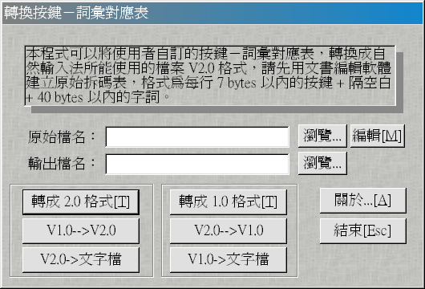
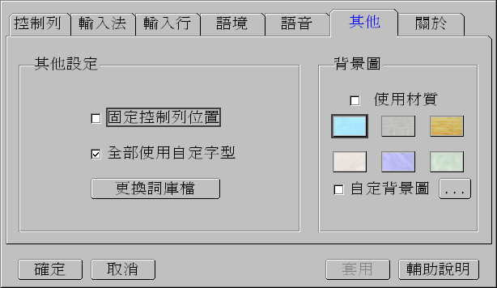
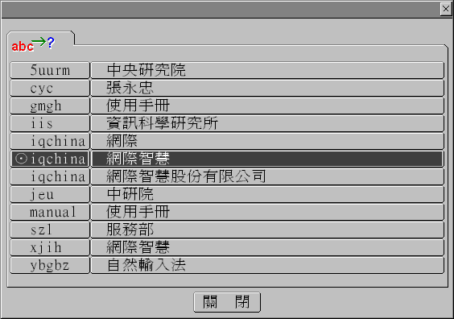
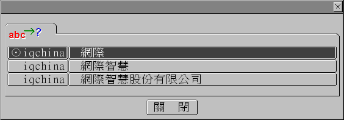
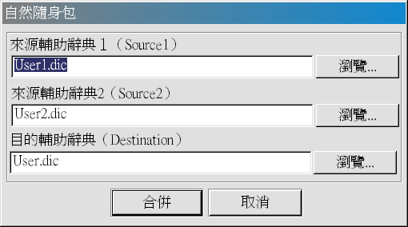

# 第五章、進階使用

本章將說明「自然輸入法」進一步的使用技巧，透過本章的敘述，發揮您的想像，使得文字輸入，就如同您口述一般的迅速。

## 5-1、注音學習精靈

### 注音學習精靈

一個外掛的輔助工具。由於「自然輸入法」具備自動學習的能力，因此，我們將「學習」的功能加以延伸，讓他變成個精靈，「閱讀」您過去的文章，學習您常用詞彙，快速建立您個人用詞習慣的詞庫。

### 「注音學習精靈」的使用方式

由  →  →  裡選取 ，然後依指示，輸入您過去文章的檔名。在確認檔名後，「注音學習精靈」會「閱讀」整篇文章的內容，並將學習到的詞彙，以 `USER.DIC` 為名，存在「安裝目錄」下的 `PHTAB` 目錄內。

您可在學習後檢視資料是否正確，特別是破音字的注音部分；在下次啟動「自然輸入法」時，系統會自動讀取 `USER.DIC` 的內容，並與第四章說明的「輔助辭典」結合。您可在[第四章](chapt4.md)內找到剛才學習的詞彙，之後系統會將 `USER.DIC` 內容清除。

「注音學習精靈」是系統內「自動學習」功能的延伸，所以詞彙判定的方法，與第四章的「自動學習」說明一樣，必須是多次使用，方才認定是您專屬詞彙。（參閱[第四章](chapt4.md)）

## 5-2、輔助辭典（二）

在[第四章](chapt4.md)介紹了「輔助辭典」的一般特性。除了透過「注音學習精靈」的幫忙，您是否想更快速地建立個人的「輔助辭典」？以下提供您一些方法，可大量建立您的「輔助辭典」，以及「輔助辭典」的一些應用方式。在開始說明之前，先介紹「輔助辭典」的輸入格式。

### 「輔助辭典」輸入格式

「輔助辭典」是由「詞彙」加上「注音符號」所組成，兩者之間以「半型空白」分隔，注音符號之間亦以「半型空白」作為分隔。例如：`中華名國△ㄓㄨㄥ△ㄏㄨㄚˊ△ㄇㄧㄥˊ△ㄍㄨㄛˊ`。本節裡，暫以「△」符號代表半型空白，以利說明。

### 「輔助辭典」的建立

經由「[注音學習精靈](#5-1注音學習精靈)」的經驗，您可以一般文字編輯軟體（如：記事本）建立 `USER.DIC` 格式的資料，並回存至「安裝目錄」下的 `PHTAB` 中，以 `USER.DIC` 為檔名。當下次重新啟動「自然輸入法」，您就會在「輔助辭典」中找到您建立的詞彙。

| 詞彙       | 注音 1   | 注音 2  | 注音 3 | 注音 4   |
| ---------- | -------- | ------- | ------ | -------- |
| 滑稽 △     | ㄍㄨ ˇ△  | ㄐㄧ    |        |          |
| 中研院 △   | ㄓㄨㄥ △ | ㄧㄢ ˊ△ | ㄩㄢ ˋ |          |
| 花旗資訊 △ | ㄏㄨㄚ △ | ㄑㄧ ˊ△ | ㄗ △   | ㄒㄩㄣ ˋ |

您或許會問：有沒有方法可以快速幫我建立注音符號？您可先編輯「詞彙」檔，一行一個詞彙（一到四字詞），前面不留空白，然後使用 `GODIC.EXE` 自動建立相關的注音符號，再將該檔以 `USER.DIC` 為名存入 `PHTAB` 目錄下，即完成建立的工作。

步驟一、編輯檔案（例如：`sample.dic`）內容：

```text
滑稽
中研院
花旗資訊
```

步驟二、使用 `GODIC.EXE`：

`GODIC.EXE` 是 MS-DOS 模式下，文字找注音符號的轉換工具，請在 MS-DOS 模式執行。

```text
c:\> godic sample.dic user.dic
```

步驟三、將 `USER.DIC` 放到 `PHTAB` 目錄下。

或許您還有問題：如果我不使用注音輸入法，輔助辭典對我是否一點幫助也沒有？如果您使用「拼音輸入法」，上述步驟一樣有效。

但是「倉頡輸入法」的使用者請注意。由於您不使用「注音」當作輸入工具，在輸入格式裡，您不需要建立注音符號（如範例中的 `sample.dic`），直接以 `USER.DIC` 為檔名存入 `B5TAB` 目錄下，「自然輸入法」一樣會於詞彙分析時使用。

### 「輔助辭典」的擴大應用

輔助辭典可應用於「語音」、「讀音」上的困擾，也可解決您新創字無法輸入的問題。

#### 語音／讀音

「滑稽」一般人常唸為「ㄏㄨㄚ ˊ ㄐㄧ」，正確語音為「ㄍㄨ ˇ ㄐㄧ」，本系統採一般讀音；如果您是古文學者，使用正確的語音，您可以「輔助辭典」的方式，建立「ㄍㄨ ˇ ㄐㄧ」的詞彙。下次您再使用「ㄍㄨ ˇ ㄐㄧ」時，就可選擇「滑稽」二字，不會只有「古蹟」而無「滑稽」。

#### 新創字

對於新創字（假設：廿），您無法由發音找出該字，您可建立 `廿△ㄕˊ` 並存檔（`USER.DIC`），下次您就可用注音「ㄕ ˊ」找到該字。

## 5-3、詞庫輸入

看完[「輔助辭典」（二）](#5-2輔助辭典二)的說明，您是否會問：現有的輸入法都不合乎目前工作上的需要，「自然輸入法」是否有方法可以讓我自創一套輸入法？答案是肯定的。這一節的「詞庫輸入」過去曾經被喚為「自創輸入法」。

### 「詞庫輸入」的格式

「詞庫」的建立是採「字碼」對應「詞彙」，不限定在四字詞以內，中間以半型空白分隔；「字碼」可以是 `0-9`、`A-Z`，最長 7 個位元組（bytes），「詞彙」最長 40 個位元組（bytes）。（例如：`citi△花旗資訊股份有限公司`）

### 「詞庫」的建立

「詞庫」是透過「詞庫轉換程式」（`WCONVERT.EXE`）來建立。

步驟一、請您以一般文字編輯軟體（如：記事本），編輯好您的詞庫檔（例如下列文字），並以 `CITI.TXT` 為名儲存起來。

| 字碼    | 詞彙                 |
| ------- | -------------------- |
| Citi    | 花旗                 |
| Citi    | 花旗資訊             |
| Citi    | 花旗資訊股份有限公司 |
| 5um     | 中央研究院           |
| 5uurm   | 中央研究院           |
| Sinica  | 中央研究院           |
| Iis     | 資訊科學研究所       |
| Yvdvurn | 資訊科學研究所       |
| ybgbz   | 自然輸入法           |
| gmgh    | 使用手冊             |
| manual  | 使用手冊             |

步驟二、使用「轉換程式」：自  →  →  選取 ，在「詞彙對應表」內，原始檔名處填入 `CITI.TXT`，輸出檔名處填入 `CITI.UDD`，然後開始轉換。





步驟三、使用「詞庫」：由  →「其他」，選擇「更換詞庫檔」，然後輸入完整路徑及檔名（例如：`c:\windows\temp\citi.udd`），即可使用新的詞庫檔。您可以按 `Ctrl+-` 調出「庫存略語」檢視詞庫載入是否成功。



### 詞庫使用

欲使用方才建立的詞庫資料，您可切換輸入法為「詞庫輸入法」，輸入「字碼」後按空白鍵，完成輸入動作；如果「字碼」對應到多個「詞彙」，您還需要輸入「代碼」，選擇您要的「詞彙」。

### 預建詞庫

本系統已內建「注音符號」的詞彙，您只要輸入「‵gph」＋`<許氏鍵盤碼>`＋`<空白鍵>`，就可打出注音符號（例如：「‵gphk」可打出「ㄎ」）。

## 5-4、首碼輸入

在使用「詞庫輸入」時，您必須在「慣用輸入法」及「詞庫輸入法」間切換，可能不甚方便，您也可用「首碼輸入」的方式，直接輸入「詞庫」詞彙。

### 使用方式

輸入時，先輸入「‵」符號，再輸入「字碼」，然後按空白鍵，就可輸入特定詞彙。如果「字碼」會對應到多個「詞彙」，您可以滑鼠選擇目前需要的「詞彙」。



「首碼輸入」除了可引用「詞庫輸入」的詞彙外，還可使用「輔助辭典」裡的「三字詞」及「四字詞」。例如：「輔助辭典」裡已學會「何時了」三字詞，您可輸入「‵ㄏㄕㄌ」（鍵盤上的 `‵cgx`）加上空白鍵，即可輸入「何時了」；此方式不含「輔助辭典」的一字詞與二字詞。

## 5-5、自然隨身包



當您回家或重新安裝「自然輸入法」後，會不會覺得重新學習「個人詞彙」、建立輔助辭典，是件很麻煩的事？如果有個工具，幫你將公司、家裡的電腦內「輔助辭典」合併，「自然隨身包」就是這樣的小工具，可輔助您合併兩個輔助辭典。

首先，您將公司電腦中安裝目錄下 `PHTAB` 裡的 `USER.*`（包含：`user.dic`、`user.udb`、`user.lrn`）複製到磁片。如果您是「倉頡」輸入法使用者，請複製 `B5TAB` 目錄裡的 `USER.*`，後續說明中的 `PHTAB` 也請更改為 `B5TAB`。

在您回家之後，插入複製好的磁片，由  →  →  執行「自然隨身包」，然後如上圖，填入您家中電腦「自然輸入法」安裝目錄（例如：`c:\going32`）下 `user.dic` 存放位置、磁片內 `user.dic` 位置，以及合併後存放位置。「自然隨身包」就會幫您合併兩個「輔助辭典」資料。
