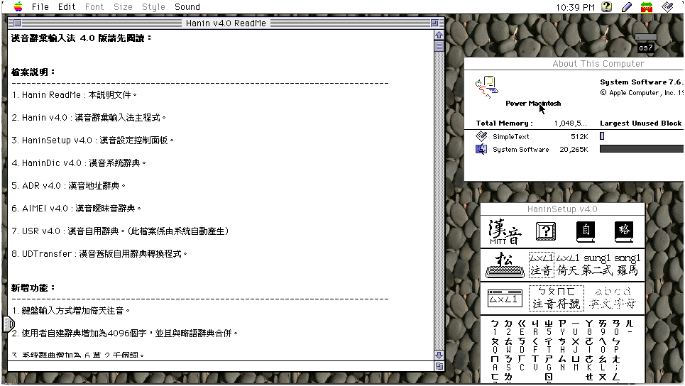

# 漢音辭彙輸入法 4.0 版請先閱讀

## 檔案說明

1. Hanin ReadMe : 本說明文件。
2. Hanin v4.0 : 漢音辭彙輸入法主程式。
3. HaninSetup v4.0 : 漢音設定控制面板。
4. HaninDic v4.0 : 漢音系統辭典。
5. ADR v4.0 : 漢音地址辭典。
6. AIMEI v4.0 : 漢音曖昧音辭典。
7. USR v4.0 : 漢音自用辭典。(此檔案係由系統自動產生)
8. UDTransfer : 漢音舊版自用辭典轉換程式。

## 新增功能

1. 鍵盤輸入方式增加倚天注音。
2. 使用者自建辭典增加為 4096 個字，並且與略語辭典合併。
3. 系統辭典增加為 6 萬 2 千個詞。
4. 提供地址辭典以提高地址及人名的辨識率。
5. 使用者自建詞長度為 2 至 5 字。
6. 增加曖昧音的功能。
7. 編輯長度改為 20 個字，超過的部份將會自動送字。
8. 改良選字視窗。
9. 原生版軟體（支援 Power Macintosh）。
10. 提供舊版自用辭典轉換程式。

## 新增功能使用說明

### A. 地址模式與一般模式切換

當你要輸入地址或人名時，由漢音的清單(Pen Menu)選擇地址模式，或是按 option+shift+A 鍵，切換至地址模式後再輸入，將可提高辨識率，若要恢復一般模式時，由漢音的清單(Pen Menu)選擇一般模式，或是按 option+shift+Z 鍵。

### B. 選擇倚天注音為輸入方式

由漢音的清單(Pen Menu)選擇漢音設定，或是打開“控制面版”檔案夾內的漢音設定檔案，然後用滑鼠按一下倚天的圖像即可。

### C. 曖昧音變換功能

曖昧音變換是指將每一個中文字的發音，取其最類似的發音組合，讓使用者選擇。例如：“ㄔ ˊ”的類似發音有“ㄔㄨ ˊ”，“ㄘ ˊ”，“ㄘㄨ ˊ”等。當你要選擇曖昧音時，將游標移到要變換的中文字後面，然後同時按 shift 鍵及空白鍵，就會出現選字視窗讓你選字，或是按空白鍵進入同音字視窗後，再用滑鼠按一下左上角曖昧音按鈕。
