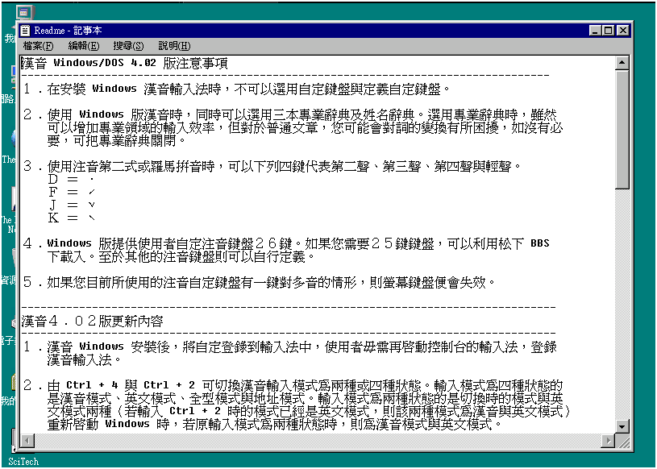

# 漢音 Windows/DOS 4.02 版注意事項



１﹒在安裝 Windows 漢音輸入法時，不可以選用自定鍵盤與定義自定鍵盤。

２﹒使用 Windows 版漢音時，同時可以選用三本專業辭典及姓名辭典。選用專業辭典時，雖然可以增加專業領域的輸入效率，但對於普通文章，您可能會對詞的變換有所困擾，如沒有必要，可把專業辭典關閉。

３﹒使用注音第二式或羅馬拼音時，可以下列四鍵代表第二聲、第三聲、第四聲與輕聲。

```
Ｄ ＝ ．
Ｆ ＝ ˊ
Ｊ ＝ ˇ
Ｋ ＝ ˋ
```

４﹒Windows 版提供使用者自定注音鍵盤２６鍵。如果您需要２５鍵鍵盤，可以利用松下 BBS
下載入。至於其他的注音鍵盤則可以自行定義。

５﹒如果您目前所使用的注音自定鍵盤有一鍵對多音的情形，則螢幕鍵盤便會失效。

## 漢音４﹒０２版更新內容

１﹒漢音 Windows 安裝後，將自定登錄到輸入法中，使用者毋需再啟動控制台的輸入法，登錄
漢音輸入法。

２﹒由 Ctrl + 4 與 Ctrl + 2 可切換漢音輸入模式為兩種或四種狀態。輸入模式為四種狀態的
是漢音模式、英文模式、全型模式與地址模式。輸入模式為兩種狀態的是切換時的模式與英
文模式兩種（若輸入 Ctrl + 2 時的模式已經是英文模式，則該兩種模式為漢音與英文模式）
重新啟動 Windows 時，若原輸入模式為兩種狀態時，則為漢音模式與英文模式。

３﹒按 Ctrl + A 可以顯示特殊符號視窗。

４﹒可以使用造字程式造字。（啟動造字程式，自檔案選單中，選擇建立新字形或開啟字形，編
輯自造字，在漢音欄位輸入注音碼（使用目前所使用的輸入方式）後。自檔案選單中，選擇
存檔（若已存在舊檔案，將蓋過舊檔案）或另存檔案（若不想蓋過原來檔案）功能。造字程
式將要求您輸入儲存字形 (_.fon) 與漢音自造字檔名 (_.tbl)。儲存後，結束 Windows ，
再啟動 Windows ，即可使用自造字。自造字，可登錄為自建詞或自建略語）。

５﹒可以用滑鼠選用詞，按 Shift + Enter 登錄自建詞。

６﹒按 Ctrl + Space 開啟或關閉漢音視窗時，將保留原先鍵入的資料。若要取消編輯視窗內的
資料，請按 Shift + Del。

７﹒在 MS-Word 6.0 中可用九宮鍵盤輸入。

## 漢音４﹒０１版更新內容

１﹒DOS 版修改 MKFONT 當使用者造字很多時，系統不穩定的現象。

２﹒DOS 追加在漢音內按空白鍵時，可選擇半形或全形輸出。您可利用 HCONF 修改之。

３﹒如果您有文字檔要轉成漢音自建詞檔的話，可執行 DOS HCONF 內之"自建詞維護"。

３﹒Windows 版修改自定鍵盤輸入方式，若有一鍵多音時，輕聲無法輸入之問題。

４﹒Windows 版修改若按到 CapsLock 鍵，出現全形字造成使用者不便之問題。

５﹒Windows 版修改略語展開後若有選擇輸出後，略語鍵會清除。

６﹒Windows 版修改漢音功能按鈕之狀態（打開或關閉）即使下一次重新進入
Windows 也不會改變。

７﹒辭典內容更新為 62000 詞，辭典壓縮（僅 436KB），專業辭典內容修正。漢音在辨識率
上改善許多。

## 漢音視窗版 4.0\* 使用釋疑

### ＊ 全形字使用

1. 您可以用英數全形字做為鍵盤符號之選擇用，例如輸入 "Q" 按空白鍵選同音異義字
   可立刻選到“ｑㄆ手“，按“＊“可選到“※☆★﹡“ 等，不是很方便嗎？

2. 全形與半形可用 Ctrl + Space 馬上切換。

3. 如果您執意要用半形字，數字您可使用九宮數字，英文只好將漢音關閉，也許更能
   讓您輸入一大串英文時得心應手呢！

### ＊ 使用“專業“辭典

1. 例如您選擇 “軍事“
   “李中校住在忠孝東路“ 一字不改 100% 正確。可給軍中漢音愛用者愛不釋手！

2. 如果您不是那麼“專業“，您可以將它關閉。
