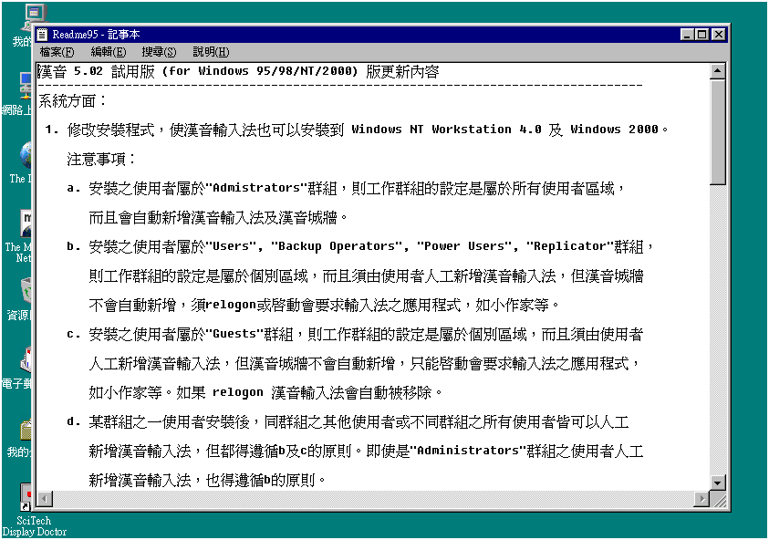

# 漢音 5.02 試用版 （for windows 95/98/NT/2000）版更新內容

## 系統方面

1. 修改安裝程式，使漢音輸入法也可以安裝到 windows NT Workstation 4.0 及 Windows 2000。注意事項：

    - a. 安裝之使用者屬於"Administrators”群組，則工作群組的設定是屬於所有使用者區域，而且會自動新增漢音輸入法及漢音城牆。
    - b. 安裝之使用者屬於"Users"，"Backup Operators", "Power Users", "Replicator"群組，則工作群組的設定是屬於個別區域，而且須由使用者人工新增漢音輸入法，但漢音城牆不會自動新增，須 relogon 或啓動會要求輸入法之應用程式，如小作家等。
    - c. 安裝之使用者屬於"Guests”群組，則工作群組的設定是屬於個別區域，而且須由使用者人工新增漢音輸入法，但漢音城牆不會自動新增，只能啓動會要求輸入法之應用程式，如小作家等。如果 relogon 漢音輸入法會自動被移除。
    - d. 某群組之一使用者安裝後，同群組之其他使用者或不同群組之所有使用者皆可以人工新增漢音輸入法，但都得遵循 b 及 c 的原則。即使是"Administrators"群組之使用者人工新增漢音輸入法，也得遵循 b 的原則。
    - e. 上述 b，c，d 原則中的漢音城牆不會自動新增，但仍可以使用漢音輸入法來輸入中文，只是無法從螢幕右下角來切換輸入法而已。

## 漢音 5.0 （for Windows 95）內容請參照“漢音說明“檔

## 漢音 5.01 （for windows 95）版更新內容

系統方面：

1. 對於任何可控制輸入法的應用程式，提供輸入界面。例如，在 WordPad 可完全由 WordPad 控制而實施行內游標跟隨。對於沒有控制輸入法的應用軟體如〝記事本"，如果您選擇“行內游標跟隨”漢音也可以提供行內游標跟隨之輸入風格。
2. 按系統工作列上關閉顯示狀態時（右下角 “漢音城牆“左邊之按鈕〉，可以完全關閉漢音狀態之顯示，不妨礙您輸入視線《或是某些展示軟體不希望輸入狀態擋住展示內容時使用》，但仍然可以繼續輸入，只是您自己必須記住漢音的輸入狀態。
3. 您可在控制台“鍵盤程式之語系選擇“將漢音設成“預設“，如此可以避免一些應用軟體將漢音關掉。或是任何應用軟體欲開啟輸入法時，可優先選用漢音輸入法。由於在漢音內也可以輸入英數（按“SHIFT"鍵〉因此不影響您中英切換之麻煩。
4. 可以在使用者造字程式内加入漢音輸入法，但以注音顯示。

核心部份：

1. 游標在字串最後時，按空白鍵選擇同音異義字時，先選擇"詞"再選擇“字"追加使用滾出方式，減少開啟視窗之時間。可由漢音工具箱內選擇同音字詞視窗顯示次數，如果選擇“立即出現“，表示和 5.0 版以前完全一樣。如果選擇二次，表示先滾出同音異義詞或字兩次後再開啓全部視窗，如果選擇四次，表示先滾出同音異義詞或字四次後再開啓全部視窗。因寫漢音使用常用字學習，您大概可在按空白 2 ～ 4 次以內，選到您所要的字詞，加快您輸入的速度與自然性。另外，對於轉換結果如不是您所想要時，可善用"ESC"鍵，來取消轉換。
2. 增加一些新詞如，“文攻武嚇“，“網際網路“，“叩應“⋯ 等。

---

## windows 95 輸入法的特徵

很多使用者不習慣 windows 95 輸入法規格（包括漢音輸入法》，是由於 95 輸入規格可以支援多視窗之輸入法，您可在某一個視窗使用某個輸入法，也可以不同視窗使用相同輸入法，但您要注意的是，您只可以同時存在一個輸入法，當您游標或滑鼠指向某個視窗，那個視窗所屬的輸入法便被開啓（Active），原先視窗所屬的輸入法被隱藏（inactive）起來。但如果您習慣了以後，就不會有所疑慮了。

---

## 注意事項

1. 重新安裝時，請先不要啓動漢音。
2. 重新安裝時，請先不要將漢音設為預設。
