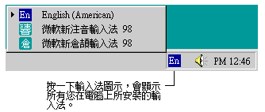

# 啟動輸入法

微軟新倉頡輸入法的啟動方式與其他輸入法相同，您可以使用下列任何一種方式來啟動：

1. 在 [工作列](toolbar.md) 右方按一下 [輸入法圖示](inputicon.md)
   ，並在出現的輸入法選項中選擇微軟新倉頡輸入法。
2. 使用鍵盤設定值來啟動輸入法，按一下 Ctrl + 空白鍵，如果在左下方的
   [輸入法狀態視窗](inputwindow.md) 出現的不是微軟新倉頡輸入法，可使用
   Ctrl + Shift 鍵循環切換，直至出現微軟新倉頡輸入法為止。

