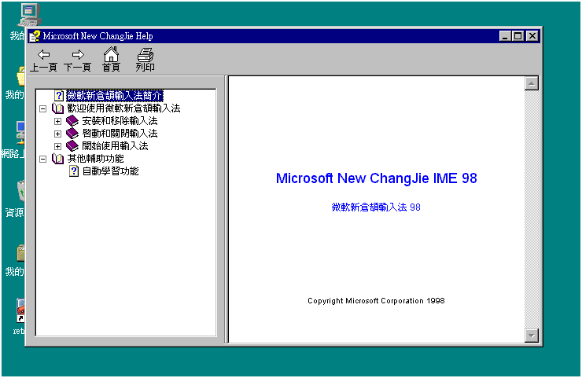

# 微軟新倉頡輸入法目錄

-   [微軟新倉頡輸入法簡介](./introduction.md)
-   歡迎使用微軟新倉頡輸入法
    -   安裝和移除輸入法
        -   [安裝輸入法](./setup.md)
        -   [移除輸入法](./remove.md)
    -   啟動和關閉輸入法
        -   [啟動輸入法](./activateime.md)
        -   [關閉輸入法](./quitime.md)
    -   開始使用輸入法
        -   輸入文字
            -   [輸入中文](./input_chinese.md)
            -   [輸入英文](./input_english.md)
            -   [取消輸入](./cancel_input.md)
        -   修改輸入文字
            -   [挑選同碼字詞](./pickup.md)
            -   [刪字](./delete_word.md)
            -   [插字](./insert_word.md)
        -   [全半形切換](./switch.md)
        -   [螢幕小鍵盤](./keyboard.md)
        -   [標點符號](./character_symbol.md)
-   其他輔助功能
    -   [自動學習功能](./auto_learn.md)
