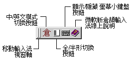

## 微軟新倉頡輸入法簡介

微軟新倉頡輸入法是一種根據傳統倉頡輸入法改良的智慧型輸入法。過去您在使用倉頡輸入
法時，可能會常常碰到這樣的情形：不是忘了某個字的倉頡碼怎麼拼，就是想不起某個字其
中的一碼。微軟新倉頡輸入法提供了一種除了可以接受完整的倉頡輸入，還可以接受以 \*
代表之不完整倉頡輸入的方式。讓您在遺忘倉頡碼的時候，也能輕鬆的輸入中文。\* (萬用
字元) 代表除了首碼以外的任意字碼，它可以是 0~4 個倉頡碼。也就是說，除了第一個倉頡
碼以外，所有您忘記的倉頡碼都可以 \*代替。有關使用 \* 更詳細的資訊，請參閱 [輸入
中文](input_chinese.md) 。當您使用此方法輸入倉頡碼或是在需要選字時，微軟新倉頡輸
入法會根據前後文自動幫您選擇最適當的字。如果所選出來的字並不是您所想要的，您還是
可以使用手動的方式挑選正確的字。有關如何使用手動方式挑選正確的字，請參閱[挑選同
碼字詞](pickup.md) 。

此外，微軟新倉頡輸入法更整合了微軟其他產品，將輸入法的使用者介面設計得更靈活：讓
您可以任意移動[輸入法狀態視窗](inputwindow.md) ，例如將之移至應用程式的工具列
中。它還提供了 [自動學習](auto_learn.md)的輔助功能，讓您在繁複的輸入工作中更能得
心應手。

