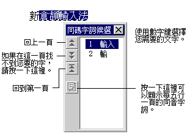

## 挑選同碼字詞

使用倉頡輸入法，您只需在少數情形之下選擇同碼的字詞，而新倉頡輸入法又會根據其前後文的關係幫助您選擇正確的字詞，免去您每次選字的不方便。若您在完成輸入之前，發現有不正確的字詞，可以利用手動方式挑選同碼字詞。請依下列步驟：

1. 使用方向鍵中的左右鍵或滑鼠將游標移動至該錯字。若您要修改的是一個詞，可以將游
   標移至該詞第一個字之前。(注意：有些應用程式並不支援滑鼠動作。)
2. 按一下空白鍵或向下鍵，出現 \[同碼字詞候選\] (Homony)
   視窗。如果是輸入的最後一個字需要修改，只要直接按下向下鍵即可而不需要移動游標。
3. 利用數字鍵或滑鼠選擇正確的字或詞。或者，也可以使用上下鍵 + Enter 鍵來選取同碼
   字詞。
4. 若未發現正確的字詞，請按 Pagedown
   繼續往下一頁搜尋，或按向右鍵展開五行一頁來搜尋。

