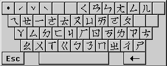

# 倚天注音鍵盤

本輸入法提供六種鍵盤設定，包括原有的標準、倚天、精業、IBM
四種鍵盤符號對應外，還加入了兩種羅馬拼音輸入方式，您可以下列步驟選擇倚天注音鍵盤：

1. 在 [輸入法狀態視窗](inputwindow.md) 上按一下右鍵，在功能表中選擇 \[內容\] (Properties)。
2. 在 \[內容\] 對話方塊中選取 \[鍵盤輸入對應\] (Keyboard Mapping) 索引標籤。
3. 選擇 \[倚天注音鍵盤\] (Eten) 核取方塊。

以下為倚天注音對應鍵盤：

