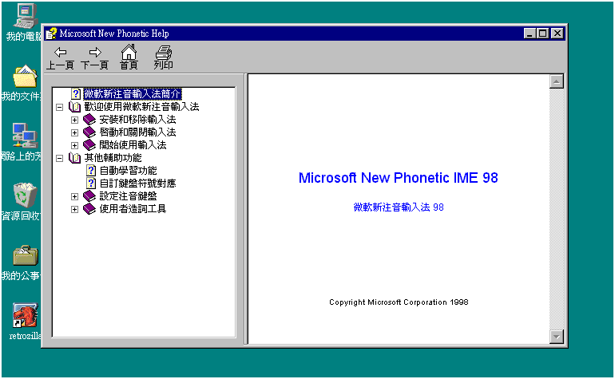

# 微軟新注音輸入法目錄

-   [微軟新注音輸入法簡介](introduction.md)
-   歡迎使用微軟新注音輸入法
    -   安裝和移除輸入法
        -   [安裝輸入法](setup.md)
        -   [移除輸入法](remove.md)
    -   啟動和關閉輸入法
        -   [啟動輸入法](activateime.md)
        -   [關閉輸入法](quitime.md)
    -   開始使用輸入法
    -   輸入文字
        -   [輸入中文][def]
        -   [輸入英文](input_english.md)
        -   [取消輸入](cancel_input.md)
    -   修改輸入文字
        -   [挑選同音字詞](pickup.md)
        -   [刪字](delete_word.md)
        -   [插字](insert_word.md)
    -   [全半形切換](switch.md)
    -   [螢幕小鍵盤](keyboard.md)
    -   [標點符號](character_symbol.md)
-   其他輔助功能
    -   [自動學習功能](auto_learn.md)
    -   [自訂鍵盤符號對應](set_keyboard_mapping.md)
    -   設定注音鍵盤
        -   [標準注音鍵盤](standard.md)
        -   [倚天注音鍵盤](eten.md)
        -   [精業注音鍵盤](chingyeah.md)
        -   [IBM 注音鍵盤](ibm.md)
        -   [羅馬拼音](rome.md)
        -   [國音二式](two.md)
    -   使用者造詞工具
        -   [使用者造詞簡介](define_userphrase.md)
        -   [啟動使用者造詞功能](activate_userphrase.md)
        -   [加入使用者造詞](insert_userphrase.md)
        -   [查詢使用者造詞](find_userphrase.md)
        -   [刪除使用者造詞](delete_userphrase.md)
        -   [儲存使用者造詞](save_userphrase.md)
        -   [關閉使用者造詞功能](close_userphrase.md)

[def]: input_chinese.md
