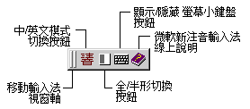

# 微軟新注音輸入法簡介

微軟新注音輸入法是一種智慧型的注音輸入法。它會根據句子本身前後文的關係以及您個人常用的字詞，自動為您所輸入的注音轉換成適當的國字；而且通常無需再從長串的字詞中挑選同音字。

微軟新注音輸入法的基本使用方法與傳統的注音輸入法相同，但更為之方便，您無需在每一次輸入注音符號後挑選同音字詞，只需在一個句子完成輸入之前，並在發生錯字的地方挑選同音字詞即可。它並更進一步的融合微軟的許多中文產品，將輸入法的使用者介面設計得更為靈活：讓您可以隨意移動
[輸入法狀態視窗](inputwindow.md)。例如，將之移至應用程式的工具列中。

此外，微軟新注音輸入法亦提供了許多其他輔助功能，如
[標點符號的設定](character_symbol.md)、[自動學習功能](auto_learn.md)、[使用者造詞工具](define_userphrase.md)
以及常用的注音鍵盤配置與 [羅馬拼音](rome.md) 輸入，還有
[自訂鍵盤符號對應](set_keyboard_mapping.md)
等功能，以符合個別的特殊需求與使用習慣。

