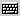

# 螢幕小鍵盤

螢幕小鍵盤是一種顯示鍵盤注音位置的工具，您可以使用下列任一種方式啟動螢幕小鍵盤：

1. 在 [輸入法狀態視窗](inputwindow.md) 按一下
   
   按鈕，即可顯示螢幕小鍵盤，再按一下即可關閉。  

2. 在輸入法狀態視窗按一下右鍵，於功能表中選擇 \[螢幕小鍵盤\] (Soft
   Keyboard)。

**提示**  
螢幕小鍵盤會根據您設定的注音鍵盤而改變。
