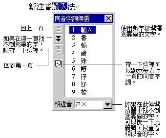

# 挑選同音字詞

在您完成輸入之前，若發現所輸入的有不正確的字詞，可以利用手動方式挑選同音字詞。

1. 使用方向鍵中的左右鍵或滑鼠將游標移動至該錯字。若您要修改的是一個詞，可以將游標移至該詞第一個字之前。(注意：有些應用程式並不支援滑鼠動作。)  

2. 按一下空白鍵或向下鍵，出現 \[同音字詞候選\] (Homony)
   視窗。如果是輸入的最後一個字需要修改，只要直接按下向下鍵即可而不需要移動游標。  

3. 利用數字鍵或滑鼠選擇正確的字或詞。或者，也可以使用上下鍵 + Enter
   鍵來選取同音字詞。  

4. 若未發現正確的字詞，請按 PageDown
   鍵繼續往下一頁搜尋，或按向右鍵展開五行一頁來搜尋。

