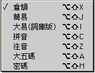
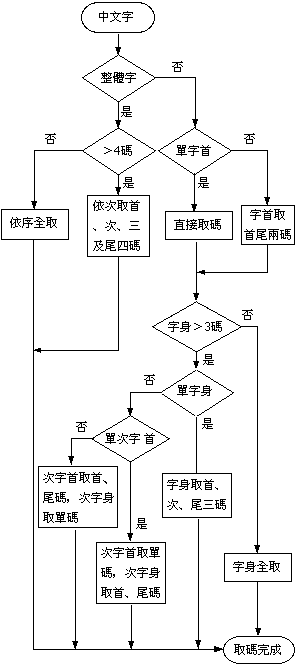
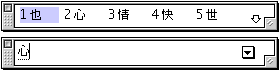
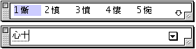
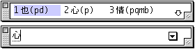
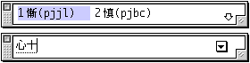
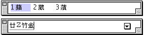
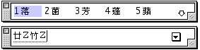

# 倉頡輸入法

## 倉頡輸入法介紹

倉頡輸入法是朱邦復先生於 1976 年研究成功的，於 1977 年正式推出，在 1981 年 2 月推出第二代，繼 1983 年問世的第三代及其後推出的第四代後，至 1991 年正式推出第五代倉頡輸入法。中文系統 8.5 及以上的系統同時支援第三代及第五代倉頡輸入法。

倉頡輸入法最基本的原理是，把中國的象形方塊字字母化，使中國文字具有與英文和拉丁文同樣方便的排列順序。倉頡輸入法編排了 24 個中文字母，比英文的 26 個字母還少 2 個；同時，中文字母在鍵盤上都有一定的位置，這樣一來，就使中文輸入倍加方便。 使用者除了背誦字母表外，還需牢記取碼規則，才能準確而迅速地找到所需的中文字；其優點是它極少有重碼字，故能快速地輸入中文字。雖然，使用者需背口訣和熟習拆字，但倉頡輸入法仍被認為是比較全面的中文輸入法。

## 倉頡輸入法取碼流程圖

## 倉頡輸入法的設置與輸入

可以從“輸入法”清單中選取“倉頡”輸入法；您亦可利用對應的快速鍵指令，在鍵盤上按 Option-Shift-X 鍵來選取“倉頡”輸入法。如果操控板已經顯示在螢幕上，那麼亦可從操控板啟動式清單中選取“倉頡”輸入法。
下面的例子說明如何以倉頡輸入法鍵入“蘋果電腦”：

1. 選取“倉頡”輸入法。
2. 鍵入“蘋”字的倉頡碼：廿卜竹金（即鍵盤上的 TYHC）。
3. 按一下空白鍵，“蘋”字便出現在輸入窗內。 
4. 請您繼續鍵入“果”（田木，即鍵盤上的 WD），“電”（一月田山，鍵盤上的 MBWU），“腦”（月女女田，鍵盤上的 BVVW）。
5. 完成輸入後，可按 return 或空白鍵把文字輸入本文內。

## 倉頡輸入法的動態提示和學習功能

如您對一種輸入法不太熟悉，可借助動態提示和學習功能來幫助您。要使用動態提示和學習功能，您必須先在“輸入法”清單中選擇“設定...”指令，然後在隨後的對話框中分別選擇“動態提示”和“學習”選項。

若只選定“學習”選項，在一個字的整個組碼輸入完後，選字窗顯示所有對應輸入碼的中文字的同時，顯示該字的組碼，方便初學者學習輸入法的組碼原則。

若無重碼，即某個倉頡碼只有一個對應的中文字或符號，則即使選定學習選項，輸入法亦不會顯示該字的組碼。

若只選定“動態提示”選項，則在每鍵入一個輸入碼時，輸入法便會立即開始找出所有對應輸入碼的中文字，並把它們顯示在選字窗內。對於不太能確定輸入碼的初學者，這個選項可幫助他們更容易選字。

例如，若您鍵入輸入碼“P”時，輸入法便會找出所有以“P”開頭的輸入碼的中文字，並把它們顯示在選字窗內。

若再鍵入另一輸入碼“J”時，輸入法便會再找出所有以“PJ”開頭的輸入碼的中文字，並把它們顯示在選字窗內。

若同時選定“學習”與“動態提示”選項，則在每鍵入一個輸入碼時，輸入法便會立即開始找出所有對應輸入碼的中文字和其組碼，並把它們顯示在選字窗內。

例如，當您鍵入輸入碼“P”時：

當您鍵入輸入碼“J”時：

## 輸入法的功能鍵

倉頡輸入法的功能鍵為“**Z**”鍵，“**Z**”鍵可以用來代替任何一個未知的輸入碼。

例如，若您不知道“蘋”字的倉頡碼的第二個輸入碼，您可以鍵入“T**Z**HC”，則輸入法便會立即找出所有對應其他三個輸入碼的中文字或符號。

您也可以同時使用多個功能鍵，如“T**Z**H**Z**”。

