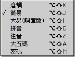
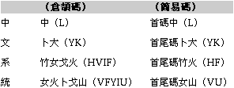

# 簡易輸入法

## 簡易輸入法介紹

簡易輸入法是根據倉頡輸入法而簡化的輸入法，只取倉頡的首尾二碼輸入，是字形輸入法的一種。

以“中文系統”四字作例：

輸入中文字時，使用者依據“倉頡字母表”的基本字母和輔助字母取碼，按由上而下，由左而右，由外而內的取碼順序，只取首、尾兩個倉頡碼，其餘的省略不取，輸入代碼後選字窗會顯示對應的中文字供使用者選擇。

簡易輸入法是一種取碼自然、簡便、易學的輸入方法，但由於輸入時減少了中文字代碼的數目，因此大大增加了重碼字的數量；使用者在鍵入代碼後，還需要進一步尋找選擇，才能選取一個適合的中文字，故簡易輸入法的輸入速度較慢。

## 簡易輸入法的設置與輸入

可以從“輸入法”清單中選取“簡易”輸入法；您亦可利用對應的快速鍵指令，在鍵盤上按 Option-Shift-J 鍵來選取“簡易”輸入法。如果操控板已經顯示在螢幕上，那麼亦可從操控板啟動式清單中選取“簡易”輸入法。
下面的例子說明如何以簡易輸入法鍵入“蘋果電腦”：

1. 選取“簡易”輸入法。
2. 鍵入“蘋”字的簡易碼：廿金（即鍵盤上的 TC）。
3. 按一下空白鍵，“蘋”字會出現在還字窗內。
4. 按對應的數字選字，“蘋”字便出現在輸入窗內。 
5. 繼續鍵入“果”（田木，即鍵盤上的 WD），“電”（一山，鍵盤上的 MU），“腦”（月田，鍵盤上的 BW）。
6. 完成輸入後，可按 return 或空白鍵把文字輸入本文內。
