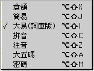
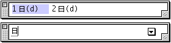

# 大易(詞庫版)輸入法

## 大易(詞庫版)輸入法介紹

大易輸入法是王贊傑先生於 1987 年所倡，其中包括 40 個鍵盤相配的“大易字母”，和 214 個相關字根，兩者合稱為“大易字母”。

Mac OS 8.6 中文版改進了大易輸入法的取碼規則，每個字只需取三碼即可，當然可以還是用您習慣的方法用四碼取字。另外加入了一個超過八萬條詞組的詞庫，所以稱之為“大易(詞庫版)”。

學習大易輸入法，您需熟悉每一個字根。由於大易輸入法共有 254 個（40+214）字根，所以記誦不易；幸而每一個字根都和它的大易字母、配屬字鍵有很深的關係，可協助使用者熟記大易字根。

## 大易輸入法的取碼規則

1. 依筆劃順序能涵蓋最多筆劃的字根，取首碼、次碼、三碼及尾碼，至多四碼，其餘省略，且寫過的筆劃不能重複取碼；例如，“生”字，應取“牛”碼。
    - 大易(詞庫版) 只需取首碼、次碼及尾碼，其餘省略。也可用傳統的四碼取字。
2. 一字之中，前後不連續之筆劃可以組成字根時，在符合節省碼數的情形下，應跨越筆順取碼；例如，“田”字取“口”碼，“乘”字取“禾”碼等。
3. 一個字或其一部份，自中間分開使左右對稱時，則中間的筆劃先寫，再寫兩側；例如，“鸞”字取“言糸糸鳥”碼；但當左右為“木、辛、王、弓”時，則仍本自由左而右取碼之。
4. 一字之中，一個字根包圍該字其他筆劃時，取碼如下：
    - a. 圖四邊，外圍之字根先寫；例如“困”字取“口木”碼。
    - b. 其他包圍情況如下：
    - i. 圍三邊，開口向下，朝左和朝右時外圍之字根先寫；例如，“匡”字取“ㄈ王”碼。
    - ii. 圍三邊，開口向上時，則裡面被包圍的部份先寫；例如，“凶”字最取“ㄨㄩ”碼。
    - iii. 圍二邊，字根居左上、右上時外圍之字根先寫；例如，“句”、“后”、 “成”、“勾”等字。
    - iv. 圍二邊，字根居左下、右下時，外圍之字根後寫；例如，“繼”、 “建”、“遠”字。
    - v. 包圍其他筆劃並非字根時，則仍本自左而右，自上而下之順序取碼；例如，“趙”、“颱”字。
5. 字根“日”與“口”在筆順完成之後才有其他筆劃貫穿，則取“日”、“口”； 例如“串”字。否則，則取“口”；例如，“由”字取“口十”碼。
6. 詞的輸入規則：詞的輸入與字的輸入為同等地位。
    - a. 輸入兩字詞時，取各字之首碼和尾碼；至多取四碼。
    - b. 輸入三字或以上之詞時，則取第一、第二、第三字之首碼和最末一字之尾碼；至多取四碼。

大易(詞庫版)包括了一個超過八萬條詞組的詞庫，熟習詞組的輸入可大大提高輸入的速度。

## 大易(詞庫版)輸入法的設置與輸入

可以從“輸入法”清單中選取“大易(詞庫版)”輸入法；您亦可利用對應的快速鍵指令，在鍵盤上按 Option-Shift-I 鍵來選取“大易(詞庫版)”輸入法。如果操控板已經顯示在螢幕上，那麼亦可從操控板啟動式清單中選取“大易(詞庫版)”輸入法。
下面的例子說明如何以大易(詞庫版)輸入法鍵入“蘋果電腦”：

1. 選取“大易(詞庫版)”輸入法。
2. 鍵入“蘋”字的大易碼：艸足八（即鍵盤上的 U98）。 
3. 按一下空白鍵，“蘋”字便出現在輸入窗內。
4. 請您繼續鍵入“果”（日木，即鍵盤上的 DI），“電”（雨日鹿，鍵盤上的 MDC），“腦”（月女魚，鍵盤上的 JLN）。
5. 完成輸入後，可按 return 或空白鍵把文字輸入本文內。

## 大易(詞庫版)輸入法的動態提示和學習功能

如您對大易(詞庫版)輸入法不太熟悉，可用學習功能來幫助您。要使用學習功能，您必須先在“輸入法”清單中選擇“設定...”指令，然後在隨後的對話框中選擇“學習”選項。

若選定“學習”選項，在一個字的整個組碼輸入完後，選字窗顯示所有對應該輸入碼的中文字的同時，顯示該字的組碼，方便初學者學習輸入法的組碼原則。

若無重碼，即某個大易(詞庫版)碼只有一個對應的中文字或符號，則即使選定學習選項，輸入法亦不會顯示該字的組碼。

**注意：**大易(詞庫版)輸入法無動態提示功能

## 大易(詞庫版)輸入法的功能鍵

大易(詞庫版)輸入法有五個功能鍵，它們各代表一個字：

-   “ ] ” －－ 街
-   “ [ ” －－ 路
-   “ - ”－－ 鄉
-   “ \ ”－－ 鎮
-   “ ' ” －－ 號

## 使用大易(詞庫版)詞典

大易(詞庫版)包括了一個超過八萬條詞組的詞庫，這個詞庫的所有詞組都在“延伸功能”檔案夾的 Main Dictionary 中。
關於使用大易(詞庫版)的 Main Dictionary，請參考“清單欄”中“繁體中文輸入法清單的簡介及功能”的“[設](../../Menu/pgs/MenuSetU.md)
[定](../../Menu/pgs/MenuSetU.md)”一節的“[詞典管理](../../Menu/pgs/MenuSetU.md#1)”部分。
