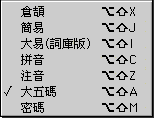
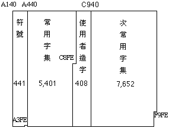

# 五碼輸入法

## 大五碼輸入法介紹

大五碼（又稱為 BIG-5 碼）的編碼是採用兩個位元，以 16 進位存放，套成公式為 XXYY。XX 為第一位元，YY 為第二位元，例如“天”的字碼為 $A4D1。每字佔用二位元。

**大五碼架構**大五碼共劃分為四個區域，分別為“符號”區、“常用字集”區、“次常用字集”區及“使用者造字”區。

其中符號有 441 個，包括 30 個中文傳輸控制碼；常用字集有 5,401 個，其餘 7,652 字為次常用字集。其中有兩對字相同，故大五碼實際上提供了 13,051 字。

**符號區**容納各種標點符號、注音符號、記號，如 $A148 代表“?”，$A3A6 為“ㄕ”；至於中文傳輸控制碼，如 $A3CC 為“跳頁”，$A3D2 為“寫入”，$A3DB 為“變碼”。“符號”區設定從 $A140 （空白字）到 $A3E0，總共有 411 個字碼。

**常用字集區**“常用字集”區設定為從 $A440 所代表的“一”，到 $C67E 所代表的“籲”一共有 5,401 字。

**次常用字集區**“次常用字集”區設定為從 $C940 所代表的“乂”，到 $F9D5 所代表的“龘”共有 7,652 字。

**使用者造字區**由 $C6A1 到 $C8FE 為止，共有 408 字。“使用者造字”區除了供給使用者自行造字外，也可以使用別人造好的字，但其先決條件是統一字碼。

在造字之前，得和別的使用單位協調溝通，各人所定的大五碼和對應文字必須相同，才能在資訊交換及流通時，取得相同的相對應文字。

## 大五碼輸入法的設置與輸入

可以從“輸入法”清單中選取“大五碼”輸入法；您亦可利用對應的快速鍵指令，在鍵盤上按 Option-Shift-A 鍵來選取“大五碼”輸入法。如果操控板已經顯示在螢幕上，那麼亦可從操控板啟動式清單中選取“大五碼”輸入法。

下面的例子說明如何以大五碼輸入法鍵入“蘋果電腦”：

1. 選取“大五碼”輸入法。
2. 鍵入“蘋”字的大五碼：c4ab，“蘋”字便出現在輸入窗內。
3. 請您繼續鍵入“果”（aa47），“電”（b971），“腦”（b8a3）。
4. 完成輸入後，可按 return 鍵把文字輸入本文內。
