# 拼音-簡拼輸入法

## 拼音輸入法介紹

拼音輸入法是根據 1958 年 2 月 11 日第一屆中國人民大會第五次會議通過的“漢語拼音”方案作為拼音標準。這個方案是歷史上各種拼音方案經驗的總結，它明確指出：制定它並不是要取代中文字，而主要是用於給中文字注音和推廣普通話。1979 年聯合國秘書處決定採用漢語拼音，1958 年 ISO（國際標準化組織）決定以漢語拼音方案為拼寫漢語的國際標準。

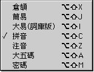

“漢語拼音方案”拼寫的是以北京語音為標準的普通話，採取音素化的音節結構，就是一個字母代表一個音素，不採取兩個或三個音素合起來用一個字母的辦法。在實用上減少了字母的類目，拼法上也便於變化。字母的形式採用國際通用的拉丁字母。

**聲母及韻母**普通話語音音節的組合，至少要有一個音素，最多不超過四個音素。按傳統的說法，每個音節開頭的輔音叫聲母，其他的元音和輔音合稱為韻母。普通話的音節可以沒有聲母，但必須有韻母。

**聲母表**

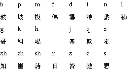

**韻母表**

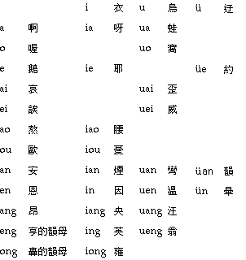

**聲調**普通話語音還有陰平、陽平、上聲、去聲和輕聲的聲調分別。中文系統的拼音輸入法需要聲調的輸入，陰平、陽平、上聲、去聲和輕聲分別以 1, 2, 3, 4 和 5 標示。在選取了“學習”選項時，選字窗內文字會分別以 1, 2, 3, 4 和 5 標示這些聲調，顯示字庫內容時也一樣。

使用者可用數字鍵盤輸入聲調，而可攜式電腦則不支援這項功能。

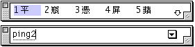

### 拼音輸入法的設置與輸入

可以從“輸入法”清單中選取“拼音”輸入法；您亦可利用對應的快速鍵指令，在鍵盤上按 Option-Shift-C 鍵來選取“拼音”輸入法。如果操控板已經顯示在螢幕上，那麼亦可從操控板啟動式清單中選取“拼音”輸入法。
下面的例子說明如何以拼音輸入法鍵入“蘋果電腦”：

1. 選取“拼音”輸入法。
2. 鍵入“蘋”字的拼音碼：（即 ping2）。
3. “蘋”字會出現在選字窗內。 
4. 按對應的數字選字。
5. 繼續鍵入“果”（guo3），“電”（dian4），“腦”（nao3）。
6. 完成輸入後，可按 return 或空白鍵把文字輸入本文內。
   對於熟悉拼音的使用者來說，使用聲調輸入會更為快捷方便；您可以在輸入拼音碼後，接著按鍵盤上的數字鍵來輸入聲調。

### 聲調的輸入

陰平、陽平、上聲、去聲和輕聲分別以 1, 2, 3, 4 和 5 標示。

**注意：**只可使用數字鍵盤輸入聲調，而可攜式電腦則不支援聲調功能。

### 拼音輸入法的動態提示和學習功能

如您對拼音輸入法不太熟悉，可借助動態提示和學習功能來幫助您。要使用動態提示和學習功能，您必須先在“輸入法”清單中選擇“設定...”指令，然後在隨後的對話框中分別選擇“動態提示”和“學習”選項。

若只選定“學習”選項，在一個字的整個組碼輸入完後，選字窗顯示所有對應該輸入碼的中文字的同時，顯示該字的組碼，方便初學者學習輸入法的組碼原則。

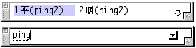

若只選定“動態提示”選項，則在每鍵入一個輸入碼時，輸入法便會立即開始找出所有對應該輸入碼的中文字，並把它們顯示在選字窗內。對於不太能確定輸入碼的初學者，這個選項可幫助他們更容易選字。

例如，若您鍵入輸入碼“P”時，輸入法便會找出所有以“P”開頭的輸入碼的中文字，並把它們顯示在選字窗內；

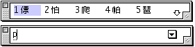

若再鍵入另一輸入碼“I”時，輸入法便會再找出所有以“PI”開頭的輸入碼的中文字，並把它們顯示在選字窗內。

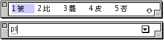

若同時選定“學習”與“動態提示”選項，則在每鍵入一個輸入碼時，輸入法便會立即開始找出所有對應該輸入碼的中文字和其組碼，並把它們顯示在選字窗內。

例如，當您鍵入輸入碼“P”時：

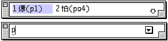

當您再鍵入輸入碼“I”時：

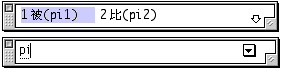

## 簡拼輸入法介紹

簡拼專為拼音輸入法而設。使用簡拼，您便可以在拼音輸入一些聲母和韻母時，只需輸入其縮寫的代碼。
各聲母和韻母及其縮寫的代號如下：

### 簡拼代碼

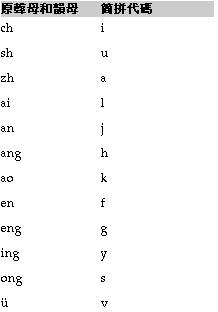

## 簡拼輸入法的設置與輸入

可首先選取“拼音”輸入法，然後從“輸入法”清單中選取“設定...”指令，並在隨後出現的“基本設置”視窗中按一下“簡拼”選項。

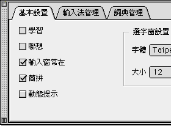

選取“簡拼”選項後，原來需鍵入“ping”以輸入“平”字，現在只需鍵入“py”便可以了。

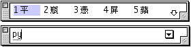
