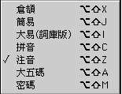
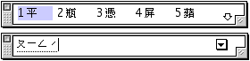
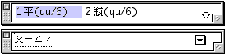
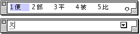
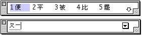
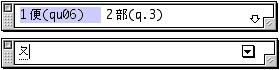
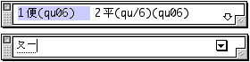
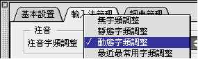

# 注音輸入法

## 注音輸入法介紹

注音和拼音輸入法，都是以中文字聲音作基礎的中文字音輸入法。

由於中文字的注音符號是小學語文學習的基礎，加以語音代碼不多，因此注音輸入法具有記憶容易、掌握迅速、操作簡單的優點，適合初學者及便於普及。

但由於中文字同音字較多，故產生許多重字，輸入時需要進一步查找和選擇，影響輸入的速度。

注音符號是由 21 個聲母、13 個韻母、三個介母組合而成的，再加上五聲的聲調符（即陰平、陽平、上聲、去聲、輕聲）以增加讀音的變化及抑揚頓挫。

其輸入原則，一般而言，是依照發音的排列，先敲聲母，其次介母，再敲韻母，最後是五聲（陰平不必敲鍵）；但並不是每個音必然有四個鍵，只是排列如此而已。

### 注音字母表

**聲母**ㄅㄆㄇㄈ ㄉㄊㄋㄌ ㄍㄎㄏ ㄐㄑㄒ
ㄓㄔㄕㄖ ㄗㄘㄙ
**韻母**ㄚㄛㄜㄝ ㄞㄟㄠㄡ ㄢㄣㄤㄥ ㄦ
**介母**ㄧㄨㄩ

### 注音輸入法的設置與輸入

可以從“輸入法”清單中選取“注音”輸入法；您亦可利用對應的快速鍵指令，在鍵盤上按 Option-Shift-Z 鍵來選取“注音”輸入法。如果操控板已經顯示在螢幕上，那麼亦可從操控板啟動式清單中選取“注音”輸入法。

下面的例子說明如何以注音輸入法鍵入“蘋果電腦”：

1. 選取“注音”輸入法。
2. 鍵入“蘋”字的注音碼：（ㄆㄧㄥ ˊ）。
3. “蘋”字會出現在選字窗內。 
4. 按對應的數字選字。
5. 繼續鍵入“果”（ㄍㄨㄛ ˇ），“電”（ㄉㄧㄢ ˋ），“腦”（ㄋㄠ ˇ）。
6. 完成輸入後，可按 return 或空白鍵把文字輸入文本內。 如果需要鍵入注音碼，可在輸入注音碼後，按 enter 鍵把注音碼輸入。

### 聲調的輸入

注音輸入法有五個聲調符即陰平、陽平、上聲、去聲、輕聲。其代碼如下：

陰平- 為注音輸入法的預置音調。在注音碼後直接敲空白鍵即可輸入陰平音調。

-   陽平- “**6**”
-   上聲- “**3**”
-   去聲- “**4**”
-   輕聲- “**7**”

## 注音輸入法的動態提示和學習功能

如您對注音輸入法不太熟悉，可借助動態提示和學習功能來幫助您。要使用動態提示和學習功能，您必須先在“輸入法”清單中選擇“設定...”指令，然後在隨後的對話框中分別選擇“動態提示”和“學習”選項。

若只選定“學習”選項，在一個字的整個組碼輸入完後，選字窗顯示所有對應該輸入碼的中文字的同時，顯示該字的組碼，方便初學者學習輸入法的組碼原則。

若只選定“動態提示”選項，則在每鍵入一個輸入碼時，輸入法便會立即開始找出所有對應該輸入碼的中文字，並把它們顯示在選字窗內。對於不太能確定輸入碼的初學者，這個選項可幫助他們更容易選字。

例如，若您鍵入輸入碼“ㄆ”（即鍵盤上的 Q）時，輸入法便會找出所有以“ㄆ”開頭的輸入碼的中文字，並把它們顯示在選字窗內；

若再鍵入另一輸入碼“ㄧ”時（即鍵盤上的 U），輸入法便會再找出所有以“ㄆㄧ”（即鍵盤上的 QU）開頭的輸入碼的中文字，並把它們顯示在選字窗內。

若同時選定“學習”與“動態提示”選項，則在每鍵入一個輸入碼時，輸入法便會立即開始找出所有對應該輸入碼的中文字和其組碼，並把它們顯示在選字窗內。

例如，當您鍵入輸入碼“ㄆ”（即鍵盤上的 Q）時：

當您再鍵入輸入碼“ㄧ”時（即鍵盤上的 U）：

### 注音字頻調整

“注音字頻調整”是繁體輸入法版本 1.7 以上的一項新增功能，使用者可以使用這項功能選擇在注音輸入法中，選字窗內與注音碼相應字元出現的次序。使用者可在“設定”視窗[選擇“注音字頻調整”的各個項目。](../../Menu/pgs/MenuSetU.md#2)
注音輸入法內置有一個字頻表，使用者輸入注音碼時，輸入法會把相應的字元，按其常用的頻率（即字頻，原來由輸入法內置）逐一在選字窗顯示出來。在版本 1.7 以前，這個排列方法是在輸入法內置的，也是固定的，使用者不能隨意改動。
在輸入法版本 1.7 以後，使用者不但可以選取調整注音字頻，更可以不同的方法來調整，可選擇方法包括：“無”、“靜態”、“動態”或“最近最常用”

“無字頻調整” — 以大五碼的次序排列字元。

“靜態字頻調整” — 使用者選取輸入法內置的注音字頻，而不去改動它。

“動態字頻調整” — 使用者每選取一個字元時，輸入法便會在其內置的字頻表相應字元的字頻加上一；一直到該字元的字頻比前一個字元高時，它在選字窗出現的次序便會順次往上移。因此當使用一個字元的次數愈多，它所出現的次序便愈前。但由於這個調整方法是受輸入法內部的字頻表所支配，故此如果兩字的字頻原本是相差很遠的，使用者便須很頻密地使用一個字元，才會改變兩個字元的排列次序。

動態的排列方法具有記憶功能，即使使用者重新啟動電腦、或關掉“注音字頻調整”後，然後再選取該功能，也可以使用自己原來的字頻表。

“最近最常用字頻調整” — 除以下幾點以外，“最近最常用”的調整方法與動態相類似：

-   “最近最常用字頻調整”不會以輸入法的內置字頻表作基礎；每個字元開始時的字頻是一樣的；故此使用者每輸入一字都會影響字元的出現次序。
-   使用者如果連續使用一個字元三次或以上，該字元的字頻會變得最高，亦會排列在選字窗的最前面。
-   如果使用者選取不使用“最近最常用字頻調整”，並關掉電腦，在此之前使用者所建立的新字頻資料會失去；重新啟動電腦後，輸入法會使用原來內置的字頻表。
