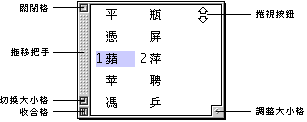
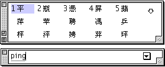

# 選字窗

輸入法會以您的鍵盤輸入來組成對應的中文字，並將所有對應的中文字在選字窗中列出。

選字窗亦是一個浮動的視窗，其預設位置在輸入窗之上；窗內的關閉格、切換大小格、拖移把手和調整大小格的功能與輸入窗的相同。

選字窗中列出了所有符合鍵盤輸入的中文字，其與目前所使用的輸入法有關；例如，在拼音輸入法中出現同碼字的機會很大，選字窗便會把所有符合使用者輸入的中文字顯示出來，供進一步選定。

但若是使用大五碼輸入法，由於其編碼原則不會出現同碼的中文字，所以，選字窗不會出現。輸入大五碼後，輸入窗便會自動組成對應的中文字。

您可以利用“設定…”對話框，來設定輸入法是否採用“動態提示”。假如設定了動態提示，則輸入法會在每輸入一個字元後，便即時尋找並顯示所有對應的中文字；對輸入法不十分熟悉的使用者，可利用這個功能，一邊輸入字元，一邊選取需要的中文字。如果您非常熟悉輸入碼，可在“設定…”對話框，設定不採用“動態提示”；那麼，系統只會在完成全部的鍵盤輸入後，才會把對應的中文字顯示出來，使輸入進行得更加快捷。

假如要顯示的中文字很多，無法在選字窗中全部顯示出來，則視窗右邊會出現向上或向下的箭頭按鈕。按一下這些按鈕，便可以捲視選字窗的內容。不管輸入窗的形狀和位置，按上下箭頭按鈕一下，就會捲動顯示上下一行。

為方便選字，選字窗會將當前一行的中文字編以號碼，只需在主鍵盤輸入對應的號碼，便可以選取所屬的中文字。您也可以利用鍵盤的上下方向鍵，改以向上或向下一行顯示號碼，方便選取其他的中文字。

您也可以利用鍵盤上的上、下、左、右方向鍵，在選字窗內上下左右移動，游標所在位置的中文字會呈選取狀態，然後按 return 鍵就可選取該字。
