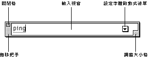
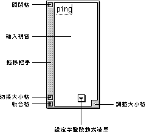
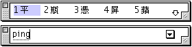
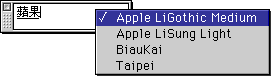

# 輸入窗

若現用語系為中文，則系統會將鍵盤輸入透過輸入法的處理，並根據所使用的中文輸入法的組碼原則，組合成中文字或其他字元。

當您鍵入第一個字元時，螢幕會先顯示一個輸入窗，其預設位置為螢幕的下方。輸入窗是一個浮動的視窗，您可以拖移其左方的拖移把手，將視窗搬移至螢幕的其他位置。

輸入窗預設為一橫放視窗，但您可以拖移視窗右下角的調整大小格來改變視窗的形狀，如下圖所示：

也就是說，輸入窗的形狀和位置均可隨意調整。

視窗的形狀經調整後，如果您需要回復視窗的預設形狀，可按一下視窗的切換大小格，輸入窗便會回到預設的形狀和位置。

您亦可利用視窗左上方的關閉格關閉輸入窗。如果沒有在“設定”對話框內選定“輸入窗常在”選項，把輸入窗內的字元輸入文稿內後，輸入窗便會自動關閉。但如果選定了“輸入窗常在”，而又想暫時關閉輸入窗，可按一下視窗的關閉格，把輸入窗關上。

收合格位於輸入窗左下角。按一下收合格可縮起或展開輸入窗。

輸入時，輸入窗會顯示鍵盤的輸入，並將之作為中文輸入的組碼；然後，根據所用的輸入法的組碼原則，組合成中文字或其他字元。

輸入窗預設使用系統字（即“Taipei”字）為顯示字體，但您可以利用視窗的設定字體啟動式清單，選用其他字體。指向倒三角形按鈕，並按壓滑鼠按鈕，該清單便會顯示當前系統可用的中文字體清單，您可選用清單上的任何一款字體作為顯示字體。

