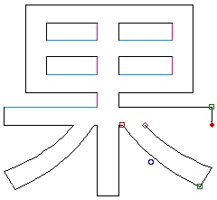
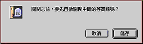

# TrueType 字形編輯的基礎

由於“TrueType 字體編輯程式”並不是全面功能的造字程式，製造新字元需要借用現存的字元，抽出所需筆劃輪廓，再組合成為新字元。

編輯 TrueType 字體時，使用者了解以下各部分是非常有用的。

## 控制點格式

-   □ 或 □“開啟曲線點” — 直線是由兩個“開啟曲線點”而組成的。
-   ○“關閉曲線點” — 直線加上“關閉曲線點”便成為一曲線。
-   ◇ 表示該控制點是處於開路，輪廓已被切斷。
-   ◆ 表示該控制點已被選取。

**控制點及輪廓處理**按待修改的輪廓一下，選取該段輪廓。輪廓的首尾會出現“□”或“□”控制點。使用者可運用“編輯”清單的各項指令或“工具面板”內的各個工具，修改該段輪廓。

**切斷輪廓**使用“編輯”清單內的“清除”或按 Delete 鍵一下，便會清除該段輪廓；同時首尾兩個控制點會變成“◇”控制點，表示該控制點處於開路狀態。
“◇”開路的控制點必須在字元修改完成時連接另一點開路控制點，使該筆劃輪廓回復“回路”狀態。否則儲存含有開路控制點的字元時，程式會出現以下的警告訊息，並自動連接開路的控制點。

**連接輪廓上的控制點**按“◇”開路控制點一下，控制點會變成“◆”，表示控制點已被選取。只要把控制點拖拉至另一開路控制點，便會把兩點以一直線連接起來。

**縮放輪廓**選取輪廓後（必須是關閉的輪廓），再選取“工具欄”上的“使用標定器”工具，拖拉滑鼠，便可以將所選輪廓放大或縮小，配給其它筆劃輪廓組合成新字元。如同時按下 Shift 鍵，則縱橫幅度便按同一比例縮放。

**畫面“縮放”與“捲視”**修改字元時，如需要放大或縮小，可使用“工具欄”上的“使用縮放程式”工具。選取工具後，在需要放大的位置按一下，便會將畫面放大 25%。由於視窗不能顯示整個字形，視窗的右邊和底部會出現“捲視”軸。如同時按下 Option 鍵，便會將畫面縮小 25%。

**選取輪廓**在輪廓線上按一下，選取該輪廓線。輪廓線首尾會顯示兩個“□”或“□”控制點。按下 Shift 鍵後，可選取多段輪廓線。按輪廓線兩下，便可全選該組輪廓線。從“編輯”清單選取“全選”則可以將整個字元的控制點全選。
