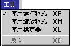
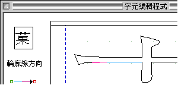
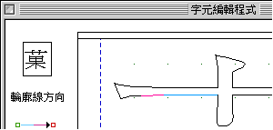

# 工具清單

## 工具清單

“工具”清單裡面的指令只可以在“字元編輯程式”中使用。

“工具”清單裡面包含了工具欄上的四個常用功能：使用選擇程式，使用縮放程式，標定器和反向。您即可以在“工具”清單中選取它們，也可以在工具欄中點選。

## 反向

輪廓方向可以控制輪廓線所組成的筆劃是中空的，還是填充黑色的。在修改字形過程中，可能字元發生部份筆劃中空處變成黑色的情況：

從“字元編輯程式”的預視小圖內，可以看見字元的部份筆劃中空處變成黑色，而非一中空方格。這時使用者只需將內框輪廓的方向反轉，便可以造出中空方格的效果。

