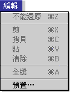
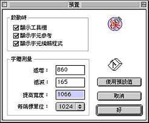

# 編輯清單

## 編輯清單

## 預置…

使用者可以使用“預置…”指令，設定程式啟動時顯示工具程式面板。

使用者也可以使用“預置…”指令，設定程式啟動時顯示 “字元參考” 面板，方便使用者造字時選擇字體樣板，參考可能引用的字元的形狀和查看字碼表內的所有字元。

使用者可以使用 “預置…”指令，設定程式啟動時打開字元編輯程式視窗，方便直接造字。

假如您在“預置…”對話框設定了程式啟動時不顯示工具程式面板，但在造字期間突然需要使用工具，您也可以在“視窗”清單下選取“顯示工具欄”指令，或按 Command-T，便可以立刻顯示工具欄。

使用者可以在 TrueType 字體預置對話框設定所造字體的幅度。由於所造字元必須與其他字體和英文字元配合，故“TrueType 字體編輯程式”設計可讓使用者設定字體幅度。設定包括字元的“遞增”、“遞減”、“提高寬度”和“每端標單位”。

TrueType 字體預置對話框內，有一個“使用預設值”的按鈕。使用者如果在更改設定後，想改變主意，只需按一下按鈕便可。

首次啟動“TrueType 字體編輯程式”時，程式會在“系統檔案夾”之“預置”檔案夾內建立一個“TrueType 字體編輯程式預置”檔案。使用者每次在“預置…”對話框更改設定，所作更改都會儲存至“TrueType 字體編輯程式預置”檔案。
