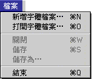

# 檔案清單

## 檔案清單

## 新增字體檔案…”指令

使用“TrueType 字體編輯程式”創建新字體檔案時，預設為建立名為“未命名”的新“正規字”檔案，使用者如要建立新“外字”檔案，必須選擇“新外字字體”選項格。製造新“未命名”時，使用者可以選取“繁體中文”、“簡體中文”、 “羅馬文”或“韓文”語系，然後可以自行設計造字。製造新“外字”時，使用者可以選取一個基本字體作底稿，然後製造一些相配合的外字。另外，如前所述，“外字”有自己的[編碼範圍](FontTTFE.md)，使用者不能替所造字設定範圍外的編碼。
除此以外，製造新“外字”時，“TrueType 字體編輯程式”會同時建立一個“外字表”在系統內。這個“外字表”使用者是不會看見的，在目前來講亦體會不到它的作用。“外字表”的主要作用是在將來更新到支援 Unicode 的系統時，“新外字”檔案能與新系統相容，使用者不必再重新造字。
