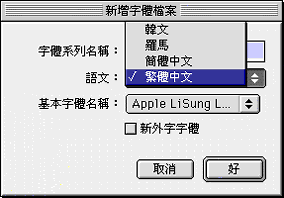
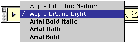
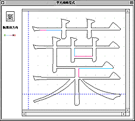
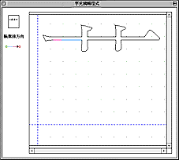
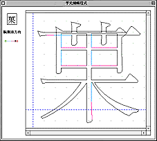
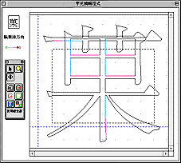
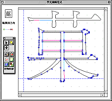
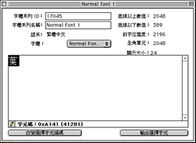
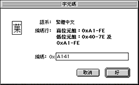

# 如何造字

使用者必須清楚新字元的筆劃結構，才能有效地修改字元或製造新字元。由於“TrueType 字體編輯程式”並不是全面的造字工具，使用者需以現存的字元加減筆劃、或從現存字元抽出部份筆劃組合成新字元，需要時可以把部份筆劃放大縮小，以附合新字元的設計。

現在試舉例說明造字的步驟。要造一個有草頭的“果”字，我們可以用“葉”字的草頭，另外把“果”字縮小，然後組合成為新字元。

1. 製造新字體檔案。您可以在檔案清單下選取“新增字體檔案…”。請參考前面章節關於“[檔案清單](FontFEFi.md)”部份。

    - 由於新造字必須儲存在一個字體檔案內，才能使用，故此使用者可以在造字前先建立一個字體檔案。
    - 對話框出現，要求您輸入字體檔案名稱。輸入名稱後，另一視窗會出現，要求您輸入字體系列名稱和語文。若您欲建立新外字檔案，則單擊“新外字字體”選項格。 
    - 您能在“字體系列名稱”欄輸入繁體中文、簡體中文、英文或韓文。
    - 在“語文”啟動動式清單內，您可以按需要選取繁體中文、簡體中文、羅馬文或韓文。
    - 從“視窗”清單選取“新增字元編輯程式”，從“字元參考”面板選取“字體樣板”清單並選取系統內的一種字體作為新字元的字體樣板。
    - 建立字體檔案後，您可以先把檔案儲存，也可以在檔案仍然打開時進行步驟 2。

2. 設定“預置…”視窗的“字體測量”數值。

    - “字體測量”的數值影響所造字體的大小、位置以及字與字間的距離。由於字體開發商眾多，工具程式的“預設值”不一定適合所有字體；最好的辦法是參照樣板字體的“字體測量”數值，重新設定預置。
    - 您可使用“檔案”清單下的“打開字體檔案…”指令打開一個現存的、用作樣板字體的檔案，然後把“字體測量”的數值寫下來，然後把同樣的數值輸入“預置”視窗內。
    - 例如，LiSung Light 的“遞增”是 845。“遞減”是 171。 “提高寬度”是 1063。“每端標單位”是 1000。
    - “每端標單位”是一啟動式清單，您可選取最接近的數值。
    - **注意：** “預置”的設定只會影響改動後所造的字，改動前的檔案還是沿用以前的預置設定。

3. 在“視窗”清單底下選取“新增字元編輯程式”指令。您也可以按 Command-E。

    - “字元編輯程式”視窗出現。在“字元參考”面板的“字體樣板”清單內選取字體樣板。 

4. 輸入“葉”字。您可以輸入法輸入所需字元，也可以打開一個現有的字體檔案， 找出所需的字元，按字元兩下，或按“輸出選擇字元”按鈕一下，以輸出所需字元。 

    - **注意：** 避免使用者傳遞檔案時有不相容的情形出現，程式設計不能更改現有的字體檔案。使用者編輯字元後，不能儲存到現有的字體檔案，只能儲存到“TrueType 字體編輯程式”所建立的字體檔案。

5. 選取及清除不需要的字元部份。

    - 選取除“草”部首以外其他部份。您可按住 Shift 鍵以同時選取不同部份的輪廓；按兩下便可選取相連的其他筆劃輪廓。
    - 從“編輯”清單選取“清除”指令，或按 Delete 鍵，以刪除所選的輪廓。  

6. 加入其它筆劃的輪廓。

    - 輸入“果”字。“葉”字的“草”頭與“果”字會重疊在一起。小心用上述的步驟選取“果”字的所有筆劃輪廓。 

7. 將字元筆劃輪廓按需要縮放。

    - 如果工具欄不在桌面上，您可以選取“視窗”清單下的“顯示工具欄”取得工具欄。
    - 選取工具欄的“標定器”工具。 
    - 您可按住滑鼠按鈕，將縮放工具放在選取字元輪廓上，待虛線框出現，可將虛線框拖拉至所需大小時，放開滑鼠按鈕。 

8. 把字元輪廓移至適當位置。

    - 您可從“工具欄”選取“使用選擇程式”工具，然後把所選字元輪廓拖至適當位置。
    - “字元編輯程式”視窗左旁的預視窗可以看見改動效果。您可重復改動直至字形滿意為止。 

9. 儲存所造字。
    - 您可以直接把預視小窗內的字拖拉放到一個打開的字體檔案內，把所造字儲存到字體檔案內。
    - 在“字體”視窗內，您可以看到所造字的字元編碼。如有需要，您可按視窗底部的“改變選擇字元編碼”按鈕一下，在隨後出現的對話框內改變編碼。
    - 視窗內的編碼行有說明可用的編碼部份，您也可以參考本章的“ [字元編碼](FontTTFE.md) ”一節。  

**使用新造字**

關於如何使用新造字，請參考“清單欄”中“繁體中文輸入法清單的簡介及功能”的“[自定義字](../../Menu/pgs/MenuUserF.md)”一節。
