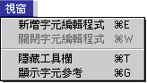
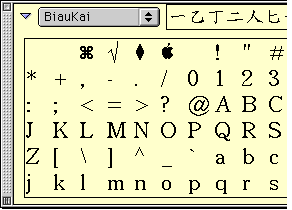

#視窗清單

**視窗清單**

**新增字元編輯程式**選取“新增字元編輯程式”後，會顯示“字元編輯程式”視窗。使用者可以在視窗內修改字元。要輸入一個字元作底稿，您可以用中文輸入法輸入字元、或使用“檔案”清單下之“打開字體檔案…”指令，打開一個現存的字體檔案，然後選取裡面的字元作底稿。

如輸入多於一個字元，其它字元會重疊顯示。

由於外字編輯程式並不是全面的造字工具，所以只可以用加減筆劃方法製造新字，因此需要輸入現存字元，抽出所需筆劃、或放大縮小字旁，而重新組合成為新字元。

**顯示／隱藏工具欄**

工具面板內有九個按鈕，從左至右，從上至下分別是：

使用選擇程式、使用縮放程式和使用標定器（方便使用者在造字時能仔細觀看細節和將字元部分縮放）、剪、拷貝、貼、清除、全選和反向。

**顯示／隱藏字元參考**

字元參考面板可以方便使用者和造字時選擇字體樣板，參考可能引用的字元的形狀。按一下左邊的三角按鈕，將顯示字碼表內的所有字元。使用者可以簡單的從字碼表中將要引用的字元拖曳到“字元編輯程式”視窗中。

