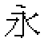
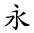

# Macintosh 字體介紹

Macintosh 的一大特點，就是能顯示各種字體的不同大小，以及字形變化；所以，螢幕所顯示的檔案格式與列印出來的效果相符，即 WYSIWYG（What You See Is What You Get，所見即所得）。這亦是 Macintosh 電腦能成為桌上出版和繪圖設計應用先驅的其中一個要素。

Macintosh 電腦所採用的字體格式，以中英文為例，可分為兩類：點陣字體和 PostScript 字體，至 Macintosh 系統軟體 7.1 版出現，蘋果電腦隨之而推出一種新的字體格式：TrueType 字體。

## 點陣字體

電腦螢幕上顯示任何的字或圖形，實際上都是一點一點畫出來的。因為受到螢光幕解析度的影響，字體是用點矩陣的方式顯示。中文的字體，通常用多少乘多少點矩陣表示，常見的有 24 乘 24 或 48 乘 48，然後在點矩陣內，以位元狀態來表示一個字的筆劃形狀。

點陣字體的儲存量需求大，但在顯示時不需要附加其他處理技術，直接把字的形狀顯示出來，所以速度快，適合作螢幕顯示之用；在清單欄上所看到的系統軟體用字 Taipei，即為此類。

如果您過去曾選購蘋果電腦公司的 Font Option Pack，也可以把其中的六款字體（中黑、中楷、隸書、行書、粗明、細明）重新安裝在“系統檔案夾”。如果所用的是 ChineseTalk II Font Option Pack，可以向蘋果特約經銷商索取這些字體的字體手提箱，然後安裝在“系統檔案夾”內。這樣，當重新開啟舊有檔案時，字體便能維持原貌。

## PostScript 字體

蘋果 LaserWriter 印表機的出現，把一種新的字體帶到電腦世界，這便是 PostScript 字體。如果使用者要求在 LaserWriter 及其後推出的其他 PostScript 印表機有高品質的輸出，PostScript 字體是必須的。

英文 PostScript 字體包括兩個檔案：螢幕字體（點陣字體）和印表機字體。只要把這兩個檔案拷貝到“系統檔案夾”內（請記著不必打開檔案夾），它們便會給放到適當的地方去。此外，印表機字體也可以放在印表機的唯讀記憶體晶片、RAM 或存放在連接到印表機的硬碟內；但列印時，PostScript 印表機必須取得 PostScript 字體，才能有高品質的輸出。

PostScript 字體是以外框向量的形式，將一個字體的筆劃形狀，以 PostScript 程式編譯起來，因此能產生高品質的輸出效果。而一套 PostScript 字體，亦可以被視為以 PostScript 語言編寫成的程式。

PostScript 字體的優點是可以將字形任意放大或縮小，但在形成字形的時候，硬體需要配備有 PostScript 的解碼程式。由於 PostScript 語言是 Adobe 公司的專利產品，具有 PostScript 解碼程式的硬體產品價格，一般要比沒有的高。

PostScript 字體的好處是，能在輸出設備輸出最佳品質的文字圖形，但當在螢幕顯示時，卻依然會出現鋸齒或毛邊的情況。

為了解決這個問題，Adobe 公司推出了 ATM（Adobe Type Manager）技術，使 PostScript 字體數據可以在螢幕顯示。安裝了 ATM 後，只要 Macintosh 內載有 PostScript 字體，這些字體便可在螢幕上顯示任何大小、品質良好的字體。

ATM 亦改良了非 PostScript 印表機的 PostScript 字體輸出效果；安裝了 ATM 後，幾乎所有的 PostScript 字體均可在任何點陣印表機、噴墨印表機或 QuickDraw 雷射印表機有高品質的輸出。

## TrueType 字體

Macintosh 電腦的螢幕顯示，採用了專利的 QuickDraw 技術，在中文系統內使用 PostScript 字體，必須通過 ATM 來進行。為提供使用者更多的選擇，蘋果電腦公司特別創製出 TrueType 字體格式，同樣是以數學方程式，描述字形輪廓。在中文系統中無需附加其他軟體，便可直接使用 TrueType 字體。
由於 TrueType 字體在螢幕顯示和列印字體描述，均使用數學方程式，故此二者都可以使用同一個字體檔案。

一般而言， TrueType 字體筆劃清晰，而且不會有鋸齒或毛邊出現，在螢幕顯示（例如幕前電腦簡報等）效果極佳，而列印時，亦能造出美觀順暢的字體。此外，蘋果電腦更致力推廣 TrueType 字體格式至其他平台，令使用者在不同平台上交換資訊，亦能獲得一致的顯示和列印效果。

中文系統附贈三種中文 TrueType 字體：Apple LiSung Light，Apple LiGothic Medium 和 BiauKai。如需要使用更多款式的中文 TrueType 字體，可向蘋果特約經銷商或其他字體開發商查詢。

Apple LiGothic Medium TrueType 字庫內 36 點、48 點、72 點和 144 點的“蘋”字 。

## 中文字體

在中文字體方面，中文系統提供了點陣字體和 TrueType 字體。由於點陣字體為固定大小的圖形點陣，假如設定的字形大小與該固定之大小不符，中文系統就得將字形的點陣，加以放大和縮小；所以，在顯示和列印時，字形便可能出現鋸齒的現象。但假如使用的是 TrueType 字體，便不會出現這種情況。中文系統會把 TrueType 字體的筆劃形狀，依所需大小運算產生，使顯示和列印，都達到完美的效果。

中文系統內的中文點陣字體，分成兩個部份儲存：字體內的單字節英文和符號部份，儲存在“系統檔案夾”的“字體”檔案夾內；而雙字節的中文字部份，則分成第一級和第二級字庫檔案，分別儲存在“系統檔案夾”內。這樣便能和中文系統 6.0 版字體檔案相容。TrueType 字體則無需這樣劃分，而是以獨立檔案形式，儲存在“字體”檔案夾內。
