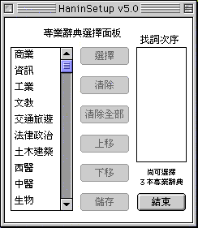
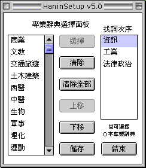
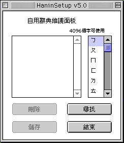
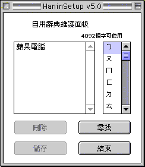
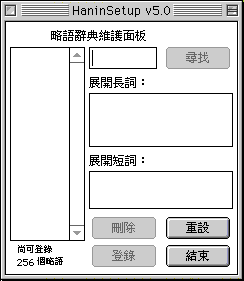
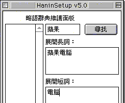
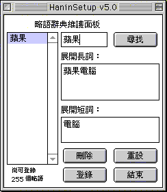

# 建立和使用專業辭典､自用辭典和略語辭典

在“漢音輸入法”清單中選取“漢音設定”，輸入法便會顯示[HaninSetup v5.0 控制面板](help:runscript="TC%20IM%20Help:shrd:OpnCntrlPnl" string="mItT")；您亦可利用對應的快速鍵指令，在鍵盤上按 Option-Shift-S 鍵，顯示 HaninSetup v5.0 控制面板（亦可從現用系統的“控制面板”檔案夾按兩下 HaninSetup v5.0 控制面板，顯示 HaninSetup v5.0 控制面板。）

## 專業辭典

按 HaninSetup v5.0 控制面板的“**專**”按扭，顯示“專業辭典選擇面板”。

Hanin 5.0.1 提供了 14 種專業辭典，它們已隨系統安裝程式安裝到您的系統中。您可以選擇不同的專業辭典，獲得各種詞組組合。

在專業辭典選擇面板的左邊列出了系統中所有的 Hanin 專業辭典。在任何一種辭典上按一下，按“選擇”按鈕，所選擇的辭典將移到右邊的“找詞次序”框。

您可以選擇多個辭典，並用“上移”和“下移”按鈕選擇搜索辭典的次序，辭典位置越靠上，優先權越高。

“清除”和“清除全部”按鈕可以移走一部或多部辭典。

選擇辭典後，按“儲存”按鈕，關閉 HaninSetup v5.0 控制面板，即可使用專業辭典了。

以下例子說明不同的專業辭典組詞的區別：

若您選擇“生物”類辭典，輸入拼音碼“gong”和“ji”，則首選的詞組是“公雞”。

若您選擇“軍事”類辭典，輸入拼音碼“gong”和“ji”，則首選的詞組是“功績”。

## 自用辭典

按 HaninSetup v5.0 控制面板的“**自**”按扭，顯示“自用辭典維護面板”。

以下例子說明如何使用自用辭典：

1. 選取“漢音”輸入法。
2. 打開一個應用程式，如 SimpleText，並建立一個新檔案。
3. 輸入“蘋果電腦”。
4. 按對應的數字選字。
    - 將插入點移到“蘋”字之前。
    - 
5. 敲 enter 鍵。
    - 現在您可以打開自用辭典維護面板，“蘋果電腦”已被儲存在自用辭典中。 
6. 另建一個新檔案，輸入“蘋”字的漢音碼，但不必敲空白鍵來在選字窗中選中該字。 
7. 依次輸入“果”，“電”，“腦”的漢音碼，同樣不必敲空白鍵來在選字窗中選中該字。當鍵入完“腦”的聲調後輸入的四字自動變為“蘋果電腦”。  

**注意：**

當自用辭典維護面板打開時詞組不能登錄辭典。

自用辭典維護面板中按鈕的用途：

-   按自用辭典維護面板中的“刪除”按鈕，可以刪除所選的詞組。
-   按自用辭典維護面板中的“儲存”按鈕，可以儲存在自用辭典維護面板中所作的修改。
-   按自用辭典維護面板中的“尋找”按鈕，尋找以某個注音碼開頭的詞組。
-   按自用辭典維護面板中的“結束”按鈕，將關閉自用辭典維護面板，如果您沒有儲存對自用辭典的修改，將提示您是否儲存。

## 略語辭典

按 HaninSetup v5.0 控制面板的“**略**”按扭，顯示“略語辭典維護面板”。

以下例子說明如何使用略語辭典：

1. 選取“漢音”輸入法。
2. 打開“略語辭典維護面板”。
3. 輸入“蘋果”在第一個框中。
4. 輸入“蘋果電腦”在“展開長詞：”框中。
5. 輸入“電腦”在“展開短詞：”框中。 
6. 按“登錄”一下，“蘋果”被登錄到略語辭典。 
7. 按“結束”一下，關閉“略語辭典維護面板”，並儲存辭彙。
8. 在一個應用程式中，如 SimepleText， 輸入“蘋果”。 
9. 敲 tab 鍵，“蘋果”轉換成展開長詞“蘋果電腦”。 
10. 再敲一下 tab 鍵，又轉換成展開短詞“電腦”。 
11. 再敲一下 tab 鍵，還原成“蘋果”。 
