# 漢音輸入法清單的簡介及功能

## 漢音輸入法清單

漢音輸入法清單包括三部分：一般模式，地址模式，漢音設定。

**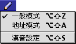**

-   一般模式可以在“漢音輸入法”清單中選取“一般模式”；您亦可利用對應的快速鍵指令，在鍵盤上按 Option-Shift-Z 鍵選取“一般模式”。使用者用一般模式輸入時，輸入法會把相應的字元，按其常用的頻率（即字頻）逐一在選字窗顯示出來。

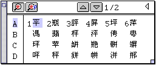

-   **地址模式**使用者用地址模式輸入時，輸入法會把常用作地址或姓名的字元顯示在選字窗的最前面。

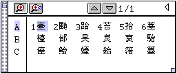

-   **漢音設定**在“漢音輸入法”清單中選取“漢音設定”，輸入法便會顯示 HaninSetup v5.0 控制面板；您亦可利用對應的快速鍵指令，在鍵盤上按 Option-Shift-S 鍵，顯示 HaninSetup v5.0 控制面板。（亦可從現用系統的“控制面板”檔案夾按兩下 HaninSetup v5.0 控制面板的圖像，顯示該控制面板。）

## HaninSetup v5.0 控制面板

HaninSetup v5.0 控制面板包含四個部分，下面分別介紹它們：

### 第一部分包含五個按鈕

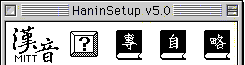

按“漢音”按鈕可獲得有關漢音輸入法的簡介，並可在簡介視窗中設定“刪除鍵不還原讀音”選項。

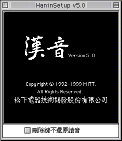

若不選定“刪除鍵不還原讀音”選項，則當您輸入一個字在輸入窗後再敲刪除鍵時該字的漢音碼會顯示在輸入窗中。

例：輸入一個字在輸入窗中，然後敲刪除鍵：

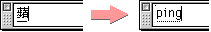

若選定“刪除鍵不還原讀音”選項，則當您輸入一個字在輸入窗後再敲刪除鍵時不會還原該字的漢音碼。

例：輸入一個字在輸入窗中，然後敲刪除鍵：

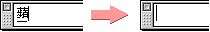

按“？”按鈕可獲取有關漢音輸入法快速鍵的信息。

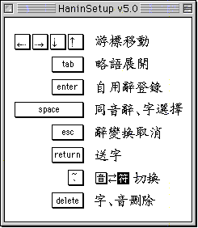

按“**專**”按鈕可打開“[專業辭典選擇面板](HanYDict.md)”。

按“**自**”按鈕可打開“[自用辭典維護面板](HanYDict.md)”。

按“**略**”按鈕可打開“[略語辭典維護面板](HanYDict.md)”。

第二部分可設定漢音輸入法的各種鍵盤佈局<

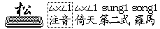

漢音輸入法有四種鍵盤佈局：注音，倚天，第二式，羅馬。可直接按一下其名稱按鈕來選擇各種鍵盤佈局，亦可透過按一下“**松**”按鈕來在各鍵盤佈局間切換。

每種鍵盤佈局的輸入碼對應于注音碼的列表顯示在控制面板的第四部分。

第三部分可設定輸入窗內以何種符號來顯示輸入碼。它包括“注音符號”和“英文字母”兩種。

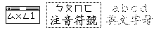

若選擇“注音符號”則輸入窗會用注音符號來顯示輸入碼，如當您用“羅馬”鍵盤佈局輸入“蘋”字的輸入碼時輸入窗顯示為：

若選擇“英文字母”則輸入窗會用英文字母來顯示輸入碼，如當您用“羅馬”鍵盤佈局輸入“蘋”字的輸入碼時輸入窗顯示為：

當鍵盤佈局為“注音”和“倚天”時只能選擇“注音符號”一種顯示方式。

第四部分顯示了各種鍵盤佈局對應於注音符號的列表。

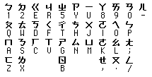

各種鍵盤佈局的聲調對應于注音碼的列表如下：

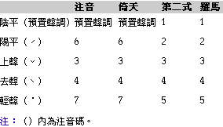

下面例子說明如何使用各鍵盤佈局輸入“蘋果電腦”：

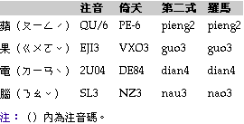

下面以“第二式”為例說明其對應關係：

-   “蘋”字的注音碼為“ㄆㄧㄥ ˊ”，而在“第二式”鍵盤佈局 “ㄆ”對應“p”，“ㄧ”對應“i”，“ㄥ”對應“eng”，而聲調“ˊ”對應“2”，所以“蘋”字在“第二式”鍵盤佈局時應用“pieng2”輸入。
-   同樣，“蘋”字在“注音”鍵盤佈局時的輸入碼為“QU/6”，在“倚天”鍵盤佈局時的輸入碼為“PE-6”，在“羅馬”鍵盤佈局時的輸入碼為“pieng2”。
