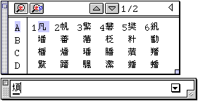
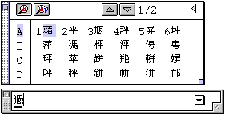
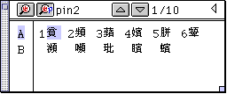
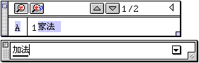
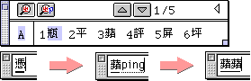

# 漢音輸入法的設置與輸入

您可以利用以下其中一種方法轉換“繁體中文”和“漢音”輸入法：

-   用滑鼠按壓現用語系圖像，並拉下“鍵盤語系”清單，拖移滑鼠至“漢音 5.0.1”輸入法，然後放開滑鼠按鈕。
-   如果現用語系是繁體中文，可按下鍵盤的 [Command ()-Option-Space](Trou_1.htm) 鍵，將現用輸入法切換至漢音輸入法，其圖像亦會顯示在清單欄上；再按 Command ()-Option-Space 鍵，又可將輸入法切換至繁體中文。

## 如何使用漢音

下面以“羅馬”鍵盤佈局為例說明如何以漢音輸入法鍵入“繁體中文”：

1. 選取“漢音”輸入法，並從 HaninSetup v5.0 控制面板中選取“羅馬”。
2. 鍵入“繁”字的漢音碼：（即 fan2）。
    - “煩”字會出現在輸入窗內。
3. 按空白鍵“繁”字會出現在選字窗內。 
4. 按對應的數字選字。
5. 繼續鍵入“體”（ti3），“中”（zhong1），“文”（wen2）。 
6. 完成輸入後，可按 return 鍵把文字輸入本文內。
    - 這和拼音輸入法相似。您也可以連續的輸入“繁體中文”的拼音碼，而不必在中間選字，當“文”的拼音碼輸入完後，詞組會自動轉換到“繁體中文”。這是“漢音輸入法”的優點。

## 漢音輸入法有曖昧提示，儲存字，詞組自動匹配和字頻調整功能

**曖昧提示**若在選字窗中按，則輸入法會顯示所有與該輸入碼具有曖昧關係的字。當前“系統檔案夾”的 Hanin5 檔案夾內 AimeiDic 檔案支持此功能。若移走 AimeiDic 檔案，則漢音輸入法無曖昧提示功能。

下面的例子說明如何使用曖昧提示功能：若用羅馬鍵盤佈局鍵入漢音碼“ping2”，然後按空白鍵以顯示選字窗。

在選字窗中按，則輸入法會顯示所有與該輸入碼具有曖昧關係的字，並在選字窗上方顯示其輸入碼。

在 Hanin 5.0.1 中您可以用鍵盤快速鍵 Shift- Space（空白鍵）直接打開曖昧選字窗，而不用先按空白鍵以顯示選字窗，然後按打開曖昧選字窗。

您還可按選字窗上方的上下箭頭符號來翻頁。

**儲存字**所輸入的文字會儲存在輸入窗中，直至按 return 鍵文字才被輸入到本文內。

可使用鍵盤上的左右箭頭在輸入窗中移動插入點，並可在任意位置增加､刪除或修改文字。

## 詞組自動匹配

以下例子說明如何用詞組自動匹配功能輸入“電腦”：

1. 選取“漢音”輸入法。
2. 鍵入“電”字的漢音碼，但不用敲空白鍵在選字窗中選中該字。
3. 繼續鍵入“腦”字的漢音碼，當輸入完“腦”字的聲調碼後輸入的字自動變為“電腦”。  若同一組漢音碼對應多個自動匹配詞組，當您輸入完詞組的漢音碼後敲空白鍵，選字窗就可顯示所有的自動匹配詞組。 如輸入“加法”後再敲空白鍵： 

**字頻調整功能**當您鍵入一個漢音碼時，輸入窗會顯示上次您用此漢音碼輸入的字。這便是漢音輸入法的字頻調整功能。若再敲一下空白鍵，輸入法會顯示所有對應該漢音碼的選字窗。

例如：首先鍵入“ping2”，從選字窗中選擇“蘋”。再一次鍵入“ping2”，從圖中可以看到“蘋”字被作為預選字輸入。

