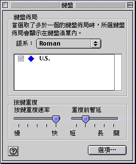
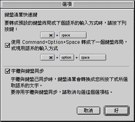

# 為何無法用 Command ()-Option-Space 鍵來在繁體中文和漢音之間切換﹖

您可能沒有選定“鍵盤”控制面板中的一個選項。

1. 在“鍵盤”控制面板中，按一下“選項…”按鈕。 
2. 按一下“使用 Command+Option+Space 轉成下一個鍵盤佈局，或現用語系的輸入方式”選項格。 
3. 按一下“好”並關閉“鍵盤”控制面板。現在就可使用 Command()+Option+Space

[]
