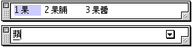

# 聯想

在“輸入法”清單中選擇“聯想”選項後，則在選字窗進行選字時，若使用該字的編號來選字，便會使用聯想尋字的方式，找出下一個最有可能的字或詞語。您亦可利用對應的快速鍵指令，在鍵盤上按 Option-Shift-W 鍵選擇“聯想”，您還可在“設定...”的“基本設置”視窗中點選“聯想”選項格，以實現“聯想”功能。

聯想尋字是透過對中文的詞法和使用習慣的分析，內建了一套詞典。在選擇一個中文字之後，聯想尋字便會提供一些可與該字組成詞語的中文字或詞，方便您快速地完成詞句的輸入。

只要在選字窗繼續以編號來選字（或詞），聯想尋字便會繼續；若改以 return 鍵來選字（或詞），則表示已完成所需的詞句，暫時停止聯想尋字。

如果不想選取聯想尋字在選字窗內顯示的字，只需繼續輸入中文字組碼，選字窗便會自動更新內容，顯示所對應的中文字。

在設定本選項時，您必須同時在“設定...”的“[詞典管理](MenuSetU.md)”視窗中打開主詞典（Main Dictionary)，才能使用聯想功能。
