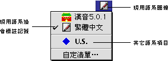

# 鍵盤清單

## 如何在中／英文語系中切換

“鍵盤”清單列出了安裝在系統上的各種語系組件，並將現用的語系圖像，顯示在清單欄上，且標註記號以資識別。您可以使用下面的兩種方法，隨意調用現用的語系：

1. 用滑鼠按一下現用語系圖像，並拉下“鍵盤”清單，拖移滑鼠至所需的語系項目，然後放開滑鼠按鈕。
2. 按下鍵盤的  鍵（在空白鍵旁），並按一下空白鍵，現用語系便切換至下一項的語系，其圖像亦會顯示在清單欄上。再按  和空白鍵，便可繼續切換現用語系。
