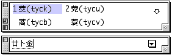
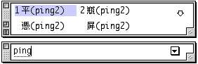
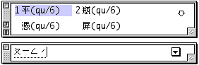

# 學習

在“輸入法”清單中選擇“學習”選項後，選字窗便會在顯示中文字的同時，在每個字後顯示該字的組碼，方便初學者學習輸入法的組碼原則。您亦可利用對應的快速鍵指令，在鍵盤上按 Option-Shift-Q 鍵選擇“學習”，您還可在“設定...”的“基本設置”視窗中點選“學習”選項格，以實現“學習”功能。

倉頡輸入法的組碼原則：

拼音輸入法的組碼原則：

注音輸入法的組碼原則：

如果使用大五碼輸入法，則即使選定這選項，輸入法亦不會顯示其組碼，因為大五碼只有一個對應的中文字或符號。
