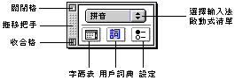
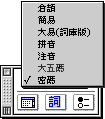
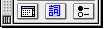

# 操控板

在“輸入法”清單上選取“顯示操控板”，輸入法介面的操控板便會在螢幕顯示；您亦可利用對應的快速鍵指令，在鍵盤上按 Option-Shift-G 鍵，顯示操控板。

操控板亦是一個浮動的視窗，其預設位置在輸入窗之上，選字窗右側。您可以拖移視窗左方的拖移把手，把操控板拖至清單欄下的任何位置，而不會影響原位置所顯示的資訊內容。

操控板內的關閉格，作用與輸入窗和選字窗內的關閉格相同，按一下便可關閉操控板，但您仍可繼續使用中文輸入法。

收合格位於操控板左下角。按一下收合格可收起或展開操控板。

操控板的上半部為一啟動式清單，顯示出當前正在使用的輸入法名稱；指向此清單並按壓滑鼠按鈕，便會顯示出當前系統中所有可用的輸入法名稱，依次為[倉頡](../../CJJY/pgs/CJJYInfo.md)、[簡易](../../CJJY/pgs/CJJYJYIF.md)、[大易(詞庫版)](../../CJJY/pgs/DaYiInfo.md)、[拼音](../../CJJY/pgs/PYJPInfo.md)、[注音](../../CJJY/pgs/ZhuYInfo.md)、[大五碼](../../CJJY/pgs/NeMaInfo.md)和[密碼](../../CJJY/pgs/MiMaSet.md)。

要切換至別的中文輸入法，請按一下清單，並按壓滑鼠向上或向下拖移，便可以在清單上選用其他的輸入法。您也可以直接從“輸入法”清單中選用輸入法，現用輸入法的清單項目前會標註有“✔”符號。

操控板下半部並排置放了三個按鈕，從左到右依次為“[字碼表](MenuSymb.md)”、“[用戶詞典](MenuUerW.md)”和“[設定](MenuSetU.md)”，只需在按鈕上按一下，便可顯示相應的對話框。

**您要了解操控板具體的功用，請選擇下列任一項目：**

| •   | [選擇輸入法](MenuSeIM.md) |
| --- | ------------------------- |
| •   | [字碼表](MenuSymb.md)     |
| •   | [用戶詞典](MenuUerW.md)   |
| •   | [設定](MenuSetU.md)       |
