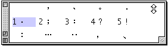

# 標點符號

在“輸入法”清單上選取“標點符號”，輸入法便會把標點符號浮動視窗顯示出來；您亦可利用對應的快速鍵指令，在鍵盤上按 Option-Shift- ﹒鍵來顯示標點符號浮動視窗。

****

“標點符號”視窗也和“[選字窗](../../FlWD/pgs/FLWDDW.md)”一樣，有關閉格、切換大小格、收合格、調整大小格和捲視按鈕。

## 點符號的輸入

您可通過在標點符號視窗中按一下所需的標點符號或敲相應的數字來輸入標點符號。
