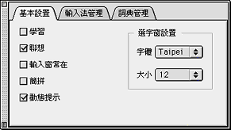
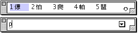
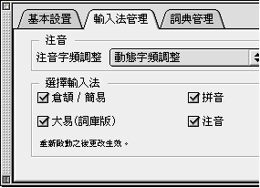
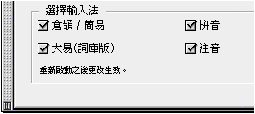
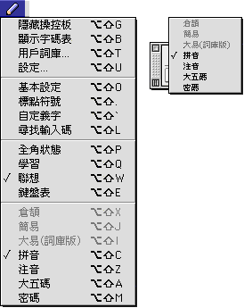
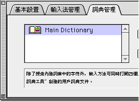
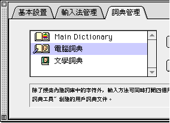

#設定

為照顧不同程度的使用者，以及個別的使用習慣，中文系統的輸入法介面具備了一些可供使用者設定的特性。

您可以在“輸入法”清單上選取“設定...”，輸入法便會顯示設定視窗；您亦可利用對應的快速鍵指令，在鍵盤上按 Option-Shift-U 鍵，顯示設定對話框。如果操控板已經顯示在螢幕上，那麼，在操控板上按一下“設定”圖像，亦是顯示設定對話框的一個快速方法。

“設定”視窗內的關閉格和收合格，作用與操控板窗內的相同。按一下關閉格可關閉設定視窗；按一下收合格可收起或展開設定視窗。

“設定”視窗包含三個部份，下面分別說明各個選項：

## 基本設置

-   **學習**請參考本章“[學習](MenuLear.md)”一節。
-   **聯想**請參考本章“[聯想](MenuAsso.md)”一節。
-   **輸入窗常在**在“輸入窗常在”的選項格按一下後，則只要現用語系為中文，即使沒有開始輸入中文，輸入窗都會顯示在螢幕上；只有當轉換現用語系，或按關閉框一下，輸入窗才會關閉。
    反之，則只有在進行中文輸入時，輸入窗才會顯示出來。
    這選項的設定，是為了照顧不同使用者的使用習慣，對輸入法的功能沒有影響。
-   **簡拼**請參考“拼音-簡拼輸入法”中的“[簡拼輸入法介紹](../../CJJY/pgs/PYJPInfo.md#Anchor-60009)”一節。
-   **動態提示**在設定了本選項後，則在每鍵入一個輸入碼時，輸入法均會立即開始找出所有對應輸入碼的中文字或符號，並把它們顯示在選字窗內。對於不太能確定輸入碼的初學者，這個選項可幫助他們更容易選字。
    
    假如沒有設定“動態提示”，系統只會在完成所有輸入後，才會把對應的中文或符號顯示出來，對於非常熟習輸入碼的使用者，輸入便可更加快捷。
-   **選字窗設置**選字窗預設的顯示字體和大小是 Taipei 字體 12 點大小，用戶可以在“基本設置”視窗改變這個設置，使用任何一種“字體”文件夾中的中文字體和 12 至 24 點大小來顯示選字窗中的字。

## 輸入法管理

**注音字頻調整**此部份包含注音字頻調整，您可從“注音字頻調整”啟動式清單中選取以下字頻調整選項：

| **1** | 無字頻調整                                             |
| ----- | ------------------------------------------------------ |
| **2** | 靜態字頻調整                                           |
| **3** | 動態字頻調整                                           |
| **4** | 最近最常用字頻調整  |

有關“注音字頻調整”的具體功能，請參考“注音輸入法”中的“[注音字頻調整](../../CJJY/pgs/ZhuYInfo.md#Anchor-1224)”一節。

**選擇輸入法**不同的使用者，其習慣使用的輸入法也有不同。由於中文系統 8.5 及以上的系統的輸入方法，是把數種不同的輸入方法放在同一個檔案內，為使習慣使用不同輸入方法的使用者，均能充分地利用系統的記憶體，故特設這個選項。

您可以在對話框內，按一下以選取常用的輸入法。框內列出的選項有四個，分別為：倉頡 ╱ 簡易、大易(詞庫版)、拼音、注音。選取以後，系統會在重新啟動電腦時，只把選取的輸入法載入記憶體中，故所佔空間較少。

由於使用中文系統時，輸入法及字體均會佔用記憶體，故中文系統 8.6 須安裝在配備有 24MB 或更高 RAM 的電腦，為充份利用記憶體，您應該利用這個選項，選取自己常用的輸入法。

您可隨意更改所作的選項。只需回到“設定”對話框，重新選取所需的輸入法；但由於需把剛選取的輸入法載入記憶體內，每次更改均需重新啟動電腦，選項方能生效。

您可以如常在“輸入法”清單或操控板中選取使用已選取的輸入法，但在“設定”對話框內沒被選取的輸入法，其項目名稱則會在“輸入法”清單或操控板中變暗，表示不能被選取使用。

**詞典管理**

可在此視窗打開或關閉主詞典（Main Dictioanry）。

每個輸入法，除了內建的主詞典（Main Dictioanry）外，還可以同時使用多至四個的用戶詞典。

輸入法使用詞典的優先次序為：

用戶詞典（可多至四個）

內部優先詞典

內部二字詞

內部三字詞

內部多字詞

用戶詞典有優先的使用順序，也就是說，如果同一組字詞，在用戶詞典中的設定與內部詞典的設定不同，則以用戶詞典中的組碼為準；另一方面，在選字窗的中文字顯示次序，也以用戶詞典內所載為先。

儲存在“延伸功能”檔案夾中的所有用戶詞典，其名稱均會顯示在“設定”對話框內；使用者可以按選擇詞典框內的任何詞典一下，然後再按“打開”按鈕一下，以打開儲存在磁碟中的用戶詞典；您也可以按詞典的項目名稱兩下，直接打開該詞典。如果需要打開多過一個詞典，可在按下鍵盤上的 Shift 鍵，同時按項目名稱來一並選取。

已打開的用戶詞典，其圖像就好像一本打開了的書本。

如果要關閉已打開的用戶自定詞典，只需按一下該項目名稱，然後按“關閉”按鈕一下便可。選取已打開的詞典項目名稱時，“打開”按鈕會變暗，表示只可按“關閉”按鈕；反之，則只可按“打開”按鈕。

用戶自定的詞典，可以儲存在磁碟中的任何位置，但最好還是存放在“系統檔案夾”內的“延伸功能”檔案夾中；因為按一下“打開”按鈕後，系統會首先從這裡開始找尋使用者詞典。
