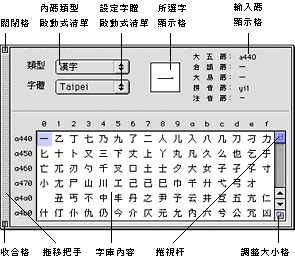
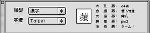
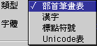
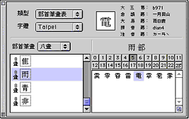
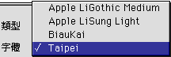
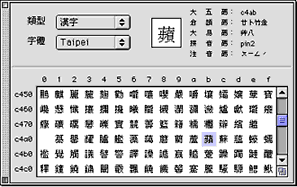

# 字碼表

在“輸入法”清單上選取“顯示字碼表”，輸入法便會把字庫顯示出來；您亦可利用對應的快速鍵指令，在鍵盤上按 Option-Shift-B 鍵，顯示字庫。假如操控板已顯示在螢幕上，那麼，在操控板上按一下“字碼表”圖像，亦是顯示字庫的一個快速方法。

“字碼表”視窗亦是一個浮動的視窗，其預設位置在螢幕中央。您可以拖移視窗左邊的拖移把手，把字庫窗拖移至清單欄下的任何位置，而不會影響原來位置所顯示的內容。

“字碼表”視窗內的關閉格，收合格和調整大小格，作用與輸入窗和選字窗內的相同。按一下關閉格可關閉“字碼表”視窗；按一下收合格可縮起或展開“字碼表”視窗；拖移調整大小格則可改變視窗的形狀，向下方拖移可顯示更多的字庫內容，要縮小視窗，只需向上方拖移即可。

“字碼表”視窗上半部顯示四項資訊：字碼類型、設定字體、所選字和輸入碼。

字碼分為四種類型：部首筆畫表、漢字、標點符號和 Unicode 表。字碼表預設顯示的類型是“部首筆畫表”，您可以利用字碼類型啟動式清單，選定所需顯示類型。

“部首筆畫表”是輸入法版本 2.1 提供的新功能，類似學習漢字時查辭典的方法來查找漢字的輸入碼。是一種能快速查找輸入碼的方法。

例如您想知道“電”的輸入碼，先查它的部首“雨”的筆畫，有八畫，則在“部首筆畫”啟動式清單中選擇“八畫”，在“部首筆畫”啟動式清單下選擇“雨”。

除開部首“雨”的八畫，“電”字還剩下五畫，在字碼表右邊字庫內容框的上面，按一下“5”，“電”字出現在字庫內容框內。選擇它即可看到它的輸入碼顯示在輸入碼顯示格中。

“字碼表”視窗預設使用系統字（即 Taipei 字體）顯示字庫，但您可以利用設定字體啟動式清單，選用其他顯示字體。指向倒三角形按鈕，並按壓滑鼠按鈕，則該清單便會顯示當前系統可用的中文字體；您可以選用清單上的任何一款字體，作為顯示的字體。這也是檢視每種字體的字形特性的最佳方法。

字碼表類型和設定字體啟動式清單右方的方格，會顯示所選的字或符號的字形。該字會較視窗下方所顯示的略作放大，方便檢視。

您所選取的字或符號除了放大顯示在方格外，其輸入碼亦會隨即顯示在方格右方。所顯示的輸入碼依次為大五碼、倉頡碼、大易碼、拼音碼和注音碼，以方便您檢視系統所有的輸入碼。

如果按壓滑鼠按鈕在字庫視窗內移動，則所選字顯示窗所顯示的字亦會隨之改變，其輸入碼也會隨著改變，而窗內所選項目亦會以反白的顏色顯示。

“字碼表”視窗下半部列出了中文字庫的內容，每行顯示 16 個中文字或符號。您可以按動捲視箭頭或拖移捲視杆，以檢視字庫內的每一個中文字和標點符號，以及其輸入碼。

事實上，字庫視窗亦可用來輸入中文字和標點符號。您只需捲動至所需的項目，按所選中文字或符號兩下，便可將之輸入文稿之內。這個方法固然是最慢的輸入法，但對於各種輸入法的初學者，或遇上較難組拼的中文字或符號，利用字庫視窗作輸入，不失為最保險的方法。您也可以透過視窗所顯示的資訊，學習該字或符號的各種組拼方法。
