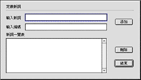
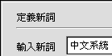
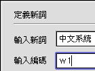
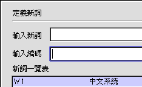
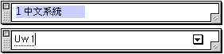
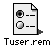

# 用戶詞典

**創建“用戶詞典”**：

1\. 打開“用戶詞典”視窗。 |

您可以使用以下任一種方法，來打開“用戶詞典”視窗，以創建您的詞庫：
按一下操控板下端居中的“用戶詞典”圖像按鈕。

• 從“輸入法”清單選“用戶詞典…”指令。
• 鍵入 Option-Shift-T。

2\. 鍵入新詞到“輸入新詞”中，如“中文系統”。您最多可以輸入十五個中文字或三十個英文字母。

 |

3\. 鍵入一到九個英文字母或數字到“輸入編碼”中，為新詞定義編碼，如“w1”。

4\. 按“添加”按鈕，新定義的詞及編碼被加到“新詞一覽表”中。

5\. 按“結束”按鈕，儲存您定義的所有新詞。

您可以定義許多新詞到“用戶詞典”。但您不能修改已定義好的詞。如果您要刪除您不再需要的詞，先選擇這個詞，然後按一下“刪除”按鈕。

## 使用“用戶詞典”

您可以在除了密碼外的任何輸入法中輸入“用戶詞典”中的詞。

只要在繁體輸入法狀態下先鍵入大寫字母 U（Shift+u)，然後再鍵入詞的編碼即可輸入詞。如您在繁體輸入法狀態下先鍵入大寫字母 U，再鍵入編碼“w1”，即可輸入“中文系統”。

## 保存“用戶詞典”的檔案

您也許希望備份您花了很多時間創建的詞庫，您只要找到“預置”檔案夾中的“Tuser.rem”檔案，並複製一份即可。當要使用此詞庫時，將“Tuser.rem”檔案移入該系統的“預置”檔案夾，不必重新開機即可使用。

