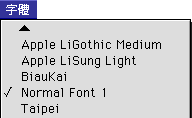
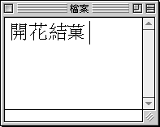
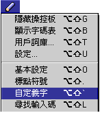
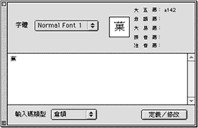
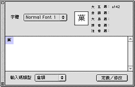
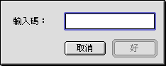

# 自定義字

**使用者如要使用所**[**造新字**](../../Font/pgs/FontFEMF.md)**，**請按以下步驟：

1. 將所需字體檔案放入“系統檔案夾”內，對話框出現，按一下“好”。重新開機後，您打開的應用程式的“字體”清單中會出現該字體檔案的名字。 
2. 打開應用程式，用日常輸入法輸入“開花結”。 
3. 在字體清單下選取所造字體名稱。
4. 您可以使用大五碼輸入法輸入所需的外字。在這情形下是“A141”。如果您想使用慣用的輸入法輸入，請參考下面的描述。  您也可以使用“拷貝”和“貼”以及“拖拉放”更方便地把外字輸入檔案內。

**注意：**如果檔案內有亂碼字，在傳遞檔案時，要避免別的使用者看到亂碼字，您應該把外字字體檔案一起傳遞。

## 用“自定義字”指令設定輸入碼

1. 選取“自定義字”指令後，螢幕上出現“自定義字”視窗。 
2. 在“字體”啟動式清單下選取要改動的字體檔案名稱。  所有使用[“TrueType 字體編輯程式”](../../Font/pgs/FontTTIF.md)製造的字體檔案名稱都會列在清單內。
3. 選取字元表內要改動的字元。 
4. 在“輸入法類型”啟動式清單選取所用的輸入法。
5. 按“定義／修改”按鈕一下。
    - “定義／修改”視窗會出現 ，您可在視窗內輸入自定的輸入碼。 
6. 鍵入輸入碼，然後按一下“好”。
7. 按一下 ` 鍵。所有使用者自造字便會出現在選字窗內。您可以再用自定義的輸入碼輸入。
