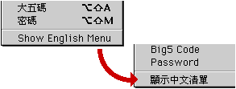

### 輸入法清單漢英對照

如果您使用的是英文系統，則在輸入法清單底部會附加一個中英文切換選項，點按該選項可使您的清單在中英文間相互轉換。

以下是輸入法清單的英漢對照表：
| 顯示／隱藏操控板 |   | Show/Hide Operation Palette |
| --- | --- | --- |
| 顯示／隱藏字碼表 |   | Show/Hide Character Table |
| 用戶詞典... |   | Edit User Dictionary... |
| 設定... |   | Preferences... |
| 基本設定 |   | Reset Default Preferences |
| 標點符號 |   | Show Punctuation |
| 自定義字 |   | Show User Defined Characters |
| 尋找輸入碼 |   | Find Input Code |
| 全角狀態 |   | Use Two Byte Roman Characters |
| 學習 |   | Show Input Key |
| 聯想 |   | Show Associated Words |
| 鍵盤表 |   | SoftKeyboard |
| 倉頡 |   | Cangjie |
| 簡易 |   | Jianyi |
| 大易（詞庫版） |   | Dayi(Pro) |
| 拼音 |   | Pinyin |
| 注音 |   | Zhuyin |
| 大五碼 |   | Big5 Code |
| 密碼 |   | Password |

[目錄表](OthFmset.htm)
