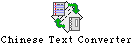
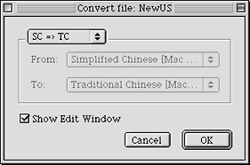
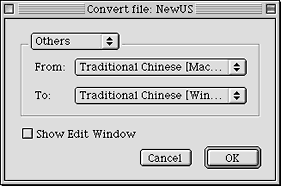
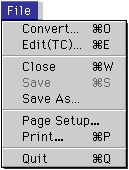
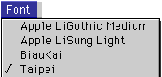
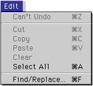
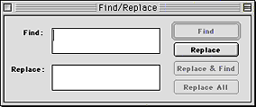

#Chinese Text Converter 程式

Chinese Text Converter 是 Mac OS 8.5 及以上的中文系統的一項新增功能，使用者可以方便地利用這項功能在繁體中文和簡體中文之間轉換檔案。

**使用 Chinese Text Converter 程式**

| **1** | 把純文字檔案拖移到 Chinese Text Converter（轉換程式）的圖像上。                                                                                                                                                                                                                                                                                                                                 |
| ----- | ----------------------------------------------------------------------------------------------------------------------------------------------------------------------------------------------------------------------------------------------------------------------------------------------------------------------------------------------------------------------------------------------- |
|       | Chinese Text Converter 在 Apple Extras 的 Chinese Utilities 檔案夾內。                                                                                                                                                                                                                                                                                             |
|       | 您也可以按兩下 Chinese Text Converter 程式的圖像，然後在隨後出現的選擇視窗中選取一個文字檔案。當然您也能使用 Chinese Text Converter 程式 File 清單中的 Convert... 指令來選取檔案。                                                                                                                                                                                                              |
|       | **注意：** Chinese Text Converter 只能轉換純文字的檔案。您可以使用任何文字處理程式，但必須把檔案儲存為純文字、即“TEXT”類型。                                                                                                                                                                                                                                                                 |
|       |                                                                                                                                                                                                                                                                                                                                                                                                 |
| **2** | 在轉換模式視窗中選擇一種轉換模式。                                                                                                                                                                                                                                                                                                                               |
|       | “SC”表示簡體中文，“TC”表示繁體中文。                                                                                                                                                                                                                                                                                                                                                            |
|       | 若按一下第一個按鈕“ SC=>TC”，將立即把簡體中文檔案轉換到繁體中文。這是 Chinese Text Converter 預設的轉換模式，按換行鍵將執行這項功能。                                                                                                                                                                                                                                                           |
|       | 若按一下第二個按鈕“TC=>SC”，將立即把繁體中文檔案轉換到簡體中文。                                                                                                                                                                                                                                                                                                                                |
|       | 若按一下第三個按鈕“ Others”，將啟動“From:”和“To:”啟動式清單，使用者可以在 “From:”啟動式清單中選擇欲轉換檔案的原代碼，在“To:”啟動式清單中選擇欲轉換檔案的目標代碼。  例如，您要將一個 Mac OS 繁體中文檔案轉換到 Windows 繁體中文檔案，則在“From:”啟動式清單中選擇“Traditional Chinese [Mac OS]”，在“To:”啟動式清單中選擇“Traditional Chinese [Windows, DOS]”。 |
|       | 如果選擇了“Show Edit Window”選項，在結束轉換時將會開啟轉換後的檔案。                                                                                                                                                                                                                                                                                                                            |
|       |                                                                                                                                                                                                                                                                                                                                                                                                 |
| **3** | 選擇好轉換模式後，按一下“Convert”按鈕。                                                                                                                                                                                                                                                                                                                                                         |
|       | Chinese Text Converter 程式會把純文字檔案轉換成為一個目標文字的檔案，儲存在原來純文字檔案同一個檔案夾內。並根據轉換後檔案的代碼在原檔案名稱後加上“(SC)”或“(TC)”或“-Converted”。                                                                                                                                                                                                                 |

**Chinese Text Converter 1.2 的新增編輯文檔功能**

Chinese Text Converter 1.2 版本在原來 1.1 版本的基礎上新增了編輯文檔的功能，方便使用者直接修改轉換後的文檔，而不必另外打開其它應用程式來做這一步。
**打開文檔**

要打開需要編輯的文檔，從 File（檔案）清單中選擇 Edit(TC)... 指令（或按快速鍵 -E），在彈出的窗口中選擇一個純文字文檔並按“打開”，電腦會自動按繁體模式打開文檔。如果您打開的是簡體文檔，要獲得正常的顯示，在打開後您需要全選文檔並從 Font（字體）清單中選擇一款簡體字體。

**選擇字體和字級**

您可以從 Font（字體）清單中選擇合適的字體，並從 Size（大小）清單中選擇合適的字級，清單中只提供六種字級，分別為 9、10、12、14、18 和 24 點字。

**查找與替換**

要修改在文檔中多次出現的同一個字或詞，可以使用 Chinese Text Converter 1.2 新增的查找與替換功能。從 Edit（編輯）清單中選擇 Find/Replace... 指令（或按快速鍵 -F）。

在“Find: ”一欄中輸入要查找的詞，在“Replace:”一欄中輸入用來替換的詞，然後按右邊的 Find 查找，找到該詞後按 Replace 替換，這樣您就完成了一次替換任務。按 Replace All 可自動完成所有相同的替換。
**列印文檔**Chinese Text Converter 1.2 新增了文檔列印功能，您可以從 File（檔案）清單中選擇 Page Setup... 設定頁面屬性，然後選擇 Print...（或按快速鍵 -P）將文檔列印出來。

[目錄表](TooFmset.htm)
